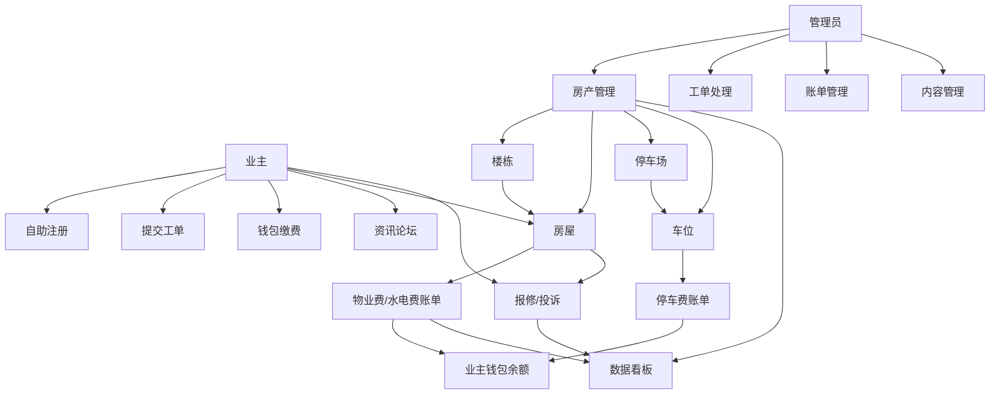
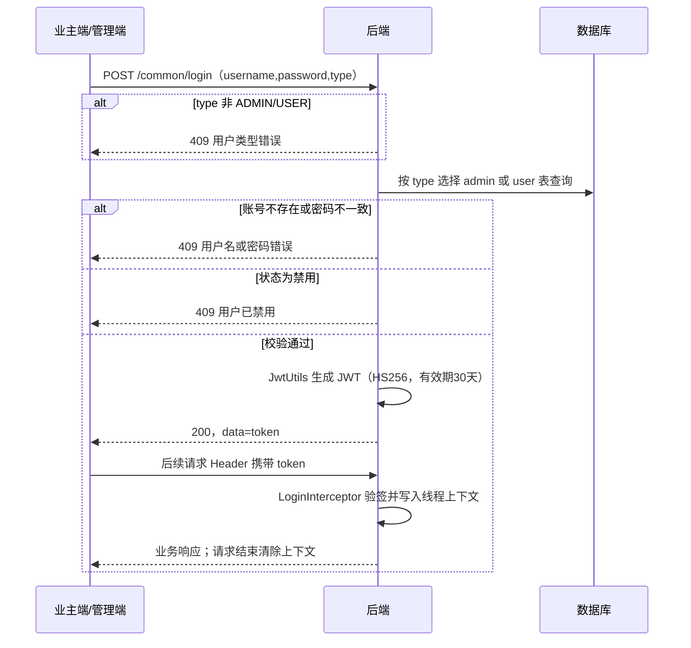
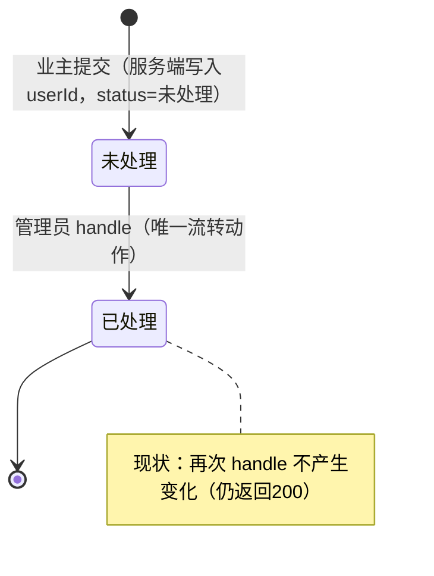
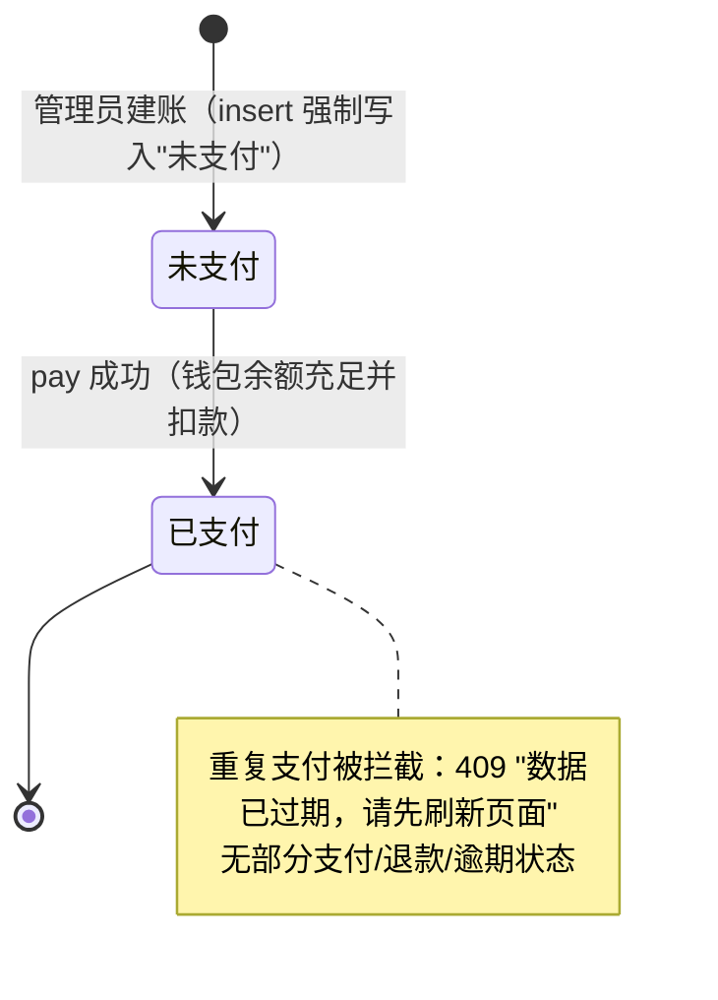

# 小区物业管理平台 产品需求文档（PRD·源码逆向版）

## 文档信息

| 项目 | 内容 |
|---|---|
| 文档名称 | 小区物业管理平台 产品需求文档（PRD·源码逆向版） |
| 工程名称 | community-system（启动类 `ProjectManagement`，版本 `1.0.0-SNAPSHOT`） |
| 当前版本 | V0.1 |
| 编写日期 | 2026-09-11 |
| 修订人 | 冯昱力 |
| 审核人 | 待评审 |
| 文档状态 | 待评审 |
| 编写依据 | ① PRD 模板（11 个一级章节）；② 工程源码（后端 `src/main`、前端 `web/src`、数据库脚本 `sql/sql.sql`、两套自动化测试） |

**版本记录**

| 版本 | 日期 | 修订人 |
|---|---|---|
| V0.1 | 2026-09-11 | 冯昱力 | 

### 文档使用约定

1. **需求状态图例**
   - **【已实现】**：源码中存在明确依据，可运行、可测试；每条均附"源码证据"。
   - **【部分已实现】**：源码有实现但不完整（如仅默认值无硬上限、仅桌面端无移动端）。
   - 已实现但源码已知存在缺陷、越权风险、校验缺失或空操作的需求，在状态后以括号注明（如"✅（越权风险）"）。
2. **优先级**：P0（必须/阻断级）、P1（重要）、P2（一般）。
3. **编号规则**：功能需求 `FR-001` 起全局连续编号；非功能需求 `NFR-001` 起。编号一经分配不复用、不重号。源码未实现的模板要求不分配编号、不纳入本文档。
4. **证据引用规则**：正文以业务语言描述；"源码证据"段保留文件、类、方法、路由、配置项等可核验信息。后端根路径 `src/main/java/com/project/platform/` 在证据中简写为 `~/`。
5. 凡源码与模板冲突之处，正文如实描述现状行为，不写模板目标要求。

---

## 目录

- [术语表](#术语表)
- [1. 项目背景与目标](#1-项目背景与目标)
- [2. 角色与权限](#2-角色与权限)
- [3. 整体业务流程](#3-整体业务流程)
- [4. 用户管理](#4-用户管理)
- [5. 楼宇房屋管理](#5-楼宇房屋管理)
- [6. 报修投诉](#6-报修投诉)
- [7. 公告管理](#7-公告管理)
- [8. 物业收费](#8-物业收费)
- [9. 非功能需求](#9-非功能需求)
- [10. 依赖与开放问题](#10-依赖与开放问题)
- [附录 A 需求追溯矩阵](#附录-a-需求追溯矩阵)
- [附录 B 源码证据索引](#附录-b-源码证据索引)
- [附录 C 旧版需求文档勘误表](#附录-c-旧版需求文档勘误表)
- [步骤 4 自检结果](#步骤-4-自检结果)

---

## 术语表

| 术语 | 定义（全文唯一口径） |
|---|---|
| 平台 | 本社区物业管理系统（community-system），含管理端与业主端两套 Web 界面、一套后端服务 |
| 管理员（ADMIN） | 登录类型为 `ADMIN` 的后台用户，账号数据存储于 `admin` 表；现网未细分岗位角色 |
| 业主（USER） | 登录类型为 `USER` 的业主用户，账号数据存储于 `user` 表；兼具平台钱包余额属性 |
| 登录类型（type） | 登录请求中区分账号体系的字段，取值仅 `ADMIN` / `USER`，其他值被拒绝 |
| 账号状态 | `启用` / `禁用` 两种中文字符串；禁用账号登录被拒绝 |
| 房屋 | 房产最小管理单元，隶属于楼栋，可指派一名业主（`house.user_id`） |
| 户主 | 被指派到某房屋的业主；一名业主可关联多套房屋，一套房屋当前仅能指派一名业主 |
| 停车场 / 车位 | 独立于房屋的两级资产：`parking_lot`（停车场，含容量）→ `parking_space`（车位，含时租价/月租价/使用人） |
| 账单 | `property_fee`（物业费）、`utility_bill_fee`（水电费）、`parking_fee`（停车费）三类收费记录的统称 |
| 账单状态 | 仅 `未支付` / `已支付` 两种 |
| 钱包余额 | 业主在 `user.balance` 上的账户余额，注册赠送 100，可充值，缴费时实时扣减 |
| 工单 | 报修（repair）与投诉（complaint）两类处理单的统称 |
| 工单状态 | 现网仅 `未处理` / `已处理` 两种 |
| 处理（handle） | 管理员将工单由"未处理"置为"已处理"的单一动作 |
| 公告 | `announcement` 表记录，仅有标题与富文本内容，无状态/分类/范围字段 |
| 新闻 / 论坛 | 资讯发布与社区交流模块（新闻含评论、论坛含评论） |
| 统一返回体 | 所有业务接口返回 `{ code, msg, data }`；成功 code=200；业务冲突 HTTP 409；未认证 401 |
| 分页返回体 | `{ list, total }`，入参 `pageNum`（默认 1）、`pageSize`（默认 10） |
| 通用 CRUD | 16 个业务域统一的 6 个接口：`page` / `selectById/{id}` / `list` / `add` / `update` / `delBatch` |
| Token | 登录成功后签发的 JWT（HS256），通过请求头 `token` 携带，现网有效期 30 天 |

---

## 1. 项目背景与目标

### 1.1 项目背景

随着小区规模扩大，物业在住户信息、房屋车位资产、报修投诉、公告通知、各项费用收缴等方面长期依赖线下或分散工具，存在信息不集中、处理过程不透明、收费与对账困难、通知触达率低、经营数据难以支撑决策等问题。本平台以信息化方式将"人（业主/管理员）—房（楼栋/房屋/车位）—事（报修/投诉）—费（物业/水电/停车费）—讯（公告/新闻/论坛）"统一管理。

### 1.2 项目目标

| 目标维度 | 已实现能力 |
|---|---|
| 经营数据可视化 | 提供 6 项数据看板：业主入住率、车位使用情况、物业费收缴情况、水费收缴情况、电费收缴情况、报修处理效率（按状态分组计数） |
| 业主自助服务 | 业主端可自助注册、查询本人房屋/账单/工单、钱包余额缴费、发布新闻评论与论坛帖子 |
| 工单处理 | 报修与投诉支持"未处理→已处理"两态流转，管理员可统一处理 |
| 费用收缴 | 物业/水电/停车三类账单手动建立，业主通过钱包余额在线缴费，重复支付自动拦截 |

### 1.3 本期范围

源码已落地并纳入本期需求的范围：

1. 账号与认证：业主/管理员两类账号的注册、登录、资料维护、改密、重置、启停用；业主钱包与充值。
2. 房产车位：楼栋、房屋、停车场、车位的台账、容量控制、归属指派与树/列表查询。
3. 报修投诉：业主提交、管理员分页查询与"未处理→已处理"。
4. 信息发布与社区：公告（富文本）、新闻与评论、论坛与评论。
5. 物业收费：物业/水电/停车三类账单的手动建立、按户查询、钱包余额缴费与重复支付拦截；6 项数据看板。
6. 通用支撑：本地文件上传/下载、JWT 登录拦截、跨域、统一返回与异常处理。

---

## 2. 角色与权限

### 2.1 角色清单（现状）

现网通过登录类型区分两类身份，**无岗位级角色、无角色表、无 Spring Security**：

| 角色 | 标识 | 数据来源 | 现状能力 |
|---|---|---|---|
| 管理员 | `ADMIN` | `admin` 表 | 登录后台；访问全部业务域的增删改查；重置账号密码；处理工单；建立/处理账单；查看全部数据看板 |
| 业主 | `USER` | `user` 表 | 注册登录；维护本人资料；查看本人房屋/账单/工单；提交报修/投诉/帖子/评论；钱包充值与缴费 |

### 2.2 事实权限矩阵

图例：✅ 功能可用；🔒 数据被强制限定为"本人"；➖ 无该业务入口；⚠️ 源码未做服务端授权限制（仅需登录）。

| 功能 | 接口 | 管理员 ADMIN | 业主 USER | 未登录 |
|---|---|---|---|---|
| 登录/注册/找回密码 | `/common/login`、`/common/register`、`/common/retrievePassword` | ✅ 公开 | ✅ 公开 | ✅ 公开 |
| 文件上传/访问 | `/file/upload`、`/file/{fileName}` | ✅ | ✅ | ✅（被放行） |
| 当前用户信息/改密/改资料 | `/common/currentUser`、`/common/updatePassword`、`/common/updateCurrentUser` | ✅ 本人 | ✅ 本人 | 401 |
| 业主/管理员账号增删改、重置密码 | `/user/**`、`/admin/**`、`/common/resetPassword` | ✅ | ⚠️ 服务端未限制（持有效 token 即可调用） | 401 |
| 楼栋/房屋/停车场/车位增删改 | 各资源域 | ✅ | ⚠️ 服务端未限制查询以外的写操作 | 401 |
| 账单建立/删除/修改 | 三类费用 `add/update/delBatch` | ✅ | ⚠️ 服务端未限制 | 401 |
| 账单明细分页 | 三类费用 `page` | ✅ 全部 | 🔒 强制按本人 userId 过滤 | 401 |
| 账单缴费 | 三类费用 `pay/{id}` | ✅ | ⚠️ 未校验账单归属（可对任意账单 id 发起，余额不足才拦截） | 401 |
| 报修/投诉提交 | `add` | ✅ | 🔒 userId 由服务端强制取登录用户（客户端伪造无效） | 401 |
| 报修/投诉分页 | `page` | ✅ 全部 | 🔒 强制按本人 userId 过滤 | 401 |
| 报修/投诉处理 | `handle/{id}` | ✅ | ⚠️ 服务端未限制 | 401 |
| 公告/新闻/论坛内容增删改 | 各内容域 | ✅ | ⚠️ 服务端未限制（前端未展示入口） | 401 |
| 数据看板 | `/echarts/**` | ✅ | ⚠️ 服务端未限制 | 401 |

> 关键事实：拦截器 `LoginInterceptor` 仅校验 token 存在性与有效性；除"分页/提交"两类接口在业务层注入本人 userId 外，**没有方法级或路径级角色授权，也没有资源归属校验**。

---

## 3. 整体业务流程

### 3.1 模块依赖关系

平台以"业主—房屋"为数据主线：账号与房产是基础数据；账单与工单依赖房屋及其户主；内容模块相对独立；所有缴费扣减业主钱包余额；数据看板对房产、收费、工单数据做分组统计。

### 3.2 登录与会话流程

### 3.3 房产—账单—工单主线规则

1. 房屋必须挂靠楼栋；房屋/车位可指派业主，指派后建立账单时自动回填户主。
2. 三类账单均记录 `house_id`/`parking_space_id` 与 `user_id`；缴费只与账单状态和业主余额相关。
3. 报修工单记录 `house_id` 与 `user_id`；投诉记录 `user_id`。
4. 删除楼栋/房屋会级联物理删除关联房屋及部分账单/工单（详见 FR-020、FR-028）。

---

## 4. 用户管理

> 现网账号分为业主（`user` 表）与管理员（`admin` 表）两套体系。业主表含钱包余额；管理员表字段与业主类似但无余额。

### 4.1 业主自助注册

#### FR-001 业主自助注册
- **优先级**：P1 ｜ **状态**：【已实现】
- **描述**：访客在注册页提交用户名、昵称、头像、密码等信息自助创建业主账号。
- **触发条件**：未登录用户在注册页提交注册表单。
- **输入**：`username`、`password`、`nickname`、`avatarUrl`（可空）、`type`（须为 `USER`，管理员不开放自助注册）。
- **处理流程**：① 校验 type；② 按 username 查重；③ 写入 `user` 表，默认 `status=启用`、`balance=100`（注册赠送）。
- **输出**：成功 code=200；失败 code=409。
- **业务规则**：① username 不可与已有业主重复；② 注册即赠送余额 100；③ 注册后账号直接可用，**无需房屋绑定验证、无需审核**。
- **异常处理**：用户名重复 → HTTP 409，msg="用户名已存在"。
- **权限**：公开（拦截器放行 `/common/register`）。
- **数据实体**：`user`（username、nickname、password、avatar_url、tel、email、balance、status、create_time）。
- **接口**：`PUT /common/register`（请求体 JSON）。
- **验收标准**：Given 不重复用户名 When 提交注册 Then 返回 200 且可使用该账号登录、余额为 100；Given 已存在用户名 When 再次注册 Then 返回 409"用户名已存在"。对应用例 `test_auth_api.py`、UI `test_register.py`（10 个用例）。
- **源码证据**：`~/controller/CommonController.java#register`；`~/service/impl/UserServiceImpl.java#register`（设置 balance=100、status="启用"）；`~/mapper/UserMapper.java`。

### 4.2 登录与会话

#### FR-002 用户登录认证
- **优先级**：P0 ｜ **状态**：【已实现】
- **描述**：业主/管理员凭用户名、密码与登录类型登录，成功后获得 JWT。
- **触发条件**：用户在登录页提交凭据。
- **输入**：`username`、`password`、`type`（`ADMIN`/`USER`）。
- **处理流程**：① 校验 type 取值；② 按 type 选择 admin/user 服务查询账号；③ 比对密码（**明文比对**）；④ 校验状态；⑤ 签发 JWT 并返回。
- **输出**：成功 data 为 token 字符串；失败 code=409。
- **业务规则**：① type 仅允许 ADMIN/USER，否则"用户类型错误"；② 密码与库中一致方可通过；③ 前端据 type 跳转管理端/业主端。
- **异常处理**：账号不存在或密码错误 → 409"用户名或密码错误"。
- **权限**：公开（放行 `/common/login`）。
- **数据实体**：`user` / `admin`；JWT claim 含 currentUser（id、type、username）。
- **接口**：`POST /common/login`。
- **验收标准**：Given 有效凭据 When 登录 Then 返回 200 且 data 为非空 token；错误密码/错误用户名/非法 type/空字段均返回 409。对应 `test_auth_api.py::TestLoginAPI`（含 SQL 注入用例）、UI `test_login.py`（10 个用例）。
- **源码证据**：`~/controller/CommonController.java#login`；`~/service/impl/UserServiceImpl.java#login`、`AdminServiceImpl.java#login`；`~/utils/JwtUtils.java#generateToken`。

#### FR-003 登录账号状态校验
- **优先级**：P0 ｜ **状态**：【已实现】
- **描述**：登录时校验账号状态，禁用账号拒绝登录。
- **触发条件**：登录凭据校验通过后。
- **输入/输出**：输入为账号 status；输出为放行或 409。
- **业务规则**：status="禁用" 一律拒绝，业主与管理员一致。
- **异常处理**：返回 HTTP 409，msg="用户已禁用"。
- **权限**：公开接口内的校验环节。
- **数据实体**：`user.status` / `admin.status`。
- **接口**：`POST /common/login`。
- **验收标准**：Given 状态为禁用的账号 When 登录 Then 返回 409"用户已禁用"。对应 `test_auth_api.py`、UI `test_login.py::test_login_disabled_user`。
- **源码证据**：`UserServiceImpl.java#login`、`AdminServiceImpl.java#login`（status 判断）。

#### FR-004 当前登录用户信息查询
- **优先级**：P1 ｜ **状态**：【已实现】
- **描述**：前端凭 token 获取当前登录用户资料（用于初始化与路由分流）。
- **触发条件**：已登录用户打开系统或刷新。
- **输入**：请求头 token（无业务入参）。
- **处理流程**：拦截器解析线程上下文中的用户 → 据 id 与 type 查库 → 返回资料。
- **输出**：`CurrentUserDTO`（id、type、username、nickname、avatarUrl、tel、email，业主另含 balance）。
- **业务规则**：无 token 或 token 无效 → 401。
- **异常处理**：401（详见 NFR-001）。
- **权限**：已登录。
- **数据实体**：`user` / `admin`。
- **接口**：`GET /common/currentUser`。
- **验收标准**：Given 有效 token When 查询 Then 返回本人资料；无 token/伪造 token 返回 401。对应 `test_auth_api.py::TestCurrentUserAPI`。
- **源码证据**：`CommonController.java#getCurrentUser`；`~/utils/CurrentUserThreadLocal.java`。

### 4.3 自助资料维护

#### FR-005 当前用户资料修改
- **优先级**：P1 ｜ **状态**：【已实现】
- **描述**：登录用户修改本人可编辑资料。
- **触发条件**：用户在个人中心提交修改。
- **输入**：`CurrentUserDTO`（nickname、avatarUrl、tel、email）。
- **处理流程**：取当前登录 id/type → 仅更新昵称、头像、电话、邮箱四个字段。
- **输出**：成功 200。
- **业务规则**：**username、balance、status、role 不可由本人通过本接口修改**（动态更新非空字段，DTO 不含这些字段）。
- **异常处理**：未登录 401。
- **权限**：已登录，仅本人。
- **数据实体**：`user` / `admin`。
- **接口**：`POST /common/updateCurrentUser`。
- **验收标准**：Given 已登录 When 修改昵称/电话 Then 再次查询返回新值；无法通过本接口改变余额或状态。
- **源码证据**：`CommonController.java#updateCurrentUser`；`UserService/AdminService#updateCurrentUser`。

#### FR-006 修改密码
- **优先级**：P0 ｜ **状态**：【已实现】
- **描述**：登录用户凭旧密码修改本人密码。
- **触发条件**：用户在个人中心提交旧密码与新密码。
- **输入**：`UpdatePasswordDTO`（oldPassword、newPassword）。
- **处理流程**：查当前账号 → 明文比对旧密码 → 更新为新密码。
- **输出**：成功 200；旧密码错误 409。
- **业务规则**：① 必须校验旧密码；② 现网对新密码强度无规则。
- **异常处理**：旧密码不符 → 409"旧密码不正确"。
- **权限**：已登录，仅本人。
- **数据实体**：`user.password` / `admin.password`。
- **接口**：`POST /common/updatePassword`。
- **验收标准**：Given 正确旧密码 When 提交新密码 Then 修改成功并可用新密码登录；旧密码错误返回 409。
- **源码证据**：`CommonController.java#updatePassword`；`UserServiceImpl.java#updatePassword`。

#### FR-007 找回密码
- **优先级**：P1 ｜ **状态**：【已实现】（含已知缺陷）
- **描述**：未登录用户通过用户名重置密码。
- **触发条件**：登录页"忘记密码"。
- **输入**：`RetrievePasswordDTO`（type、username、code、password）。
- **处理流程**：校验账号存在 → 直接更新为新密码。
- **输出**：成功 200；账号不存在 409。
- **业务规则**：**现状不校验验证码 code（源码保留 `//TODO 校验验证码` 注释），任意 code 均可重置**。
- **异常处理**：用户不存在 → 409"用户不存在"。
- **权限**：公开（放行 `/common/retrievePassword`）。
- **数据实体**：`user` / `admin`。
- **接口**：`POST /common/retrievePassword`。
- **验收标准（现状）**：Given 存在的用户名 When 提交任意验证码与新密码 Then 密码被重置。注：验证码不校验为已知缺陷。
- **源码证据**：`CommonController.java#retrievePassword`；`UserServiceImpl.java#retrievePassword`（TODO 注释）。

#### FR-008 管理员重置账号密码
- **优先级**：P1 ｜ **状态**：【已实现】（含已知越权风险）
- **描述**：将指定业主或管理员账号密码重置为系统默认密码。
- **触发条件**：管理员在用户管理页点击"重置密码"。
- **输入**：query 参数 `type`、`id`。
- **处理流程**：按 type/id 查询账号 → 更新密码为配置项 `resetPassword`（默认 `123456`）。
- **输出**：成功 200；账号不存在 409。
- **业务规则**：默认密码由配置 `resetPassword` 决定。**现状未校验调用者是否为管理员，任何持有效 token 的用户均可重置任意账号**。
- **异常处理**：用户不存在 → 409"用户不存在"。
- **权限**：现状=已登录即可。
- **数据实体**：`user` / `admin`；配置 `resetPassword`。
- **接口**：`POST /common/resetPassword?type=&id=`。
- **验收标准（现状）**：Given 任意有效 token When 传目标 id Then 密码被重置为 123456；`test_security_api.py::TestPermissionBypass` 已覆盖该越权事实。
- **源码证据**：`CommonController.java#resetPassword`；`UserServiceImpl/AdminServiceImpl#resetPassword`；`application.yaml` 中 `resetPassword: 123456`。

### 4.4 钱包与充值

#### FR-009 业主余额充值
- **优先级**：P1 ｜ **状态**：【已实现】
- **描述**：业主向本人钱包账户充值，余额用于缴纳各类账单。
- **触发条件**：业主在余额/个人中心发起充值。
- **输入**：路径参数 `amount`（数值）。
- **处理流程**：取当前登录业主 → 校验金额 → 在原余额上累加（原余额为 null 时按 0 处理）→ 更新。
- **输出**：成功 200。
- **业务规则**：① amount 必须大于 0；② 只能给当前登录用户本人充值（id 取自登录态，不信任客户端）；③ 余额可被账单缴费扣减（见 FR-066）。
- **异常处理**：amount 为 null 或 ≤0 → 409"充值金额必须大于0"；用户不存在 → 409"用户不存在"。
- **权限**：已登录（业主本人）。
- **数据实体**：`user.balance`。
- **接口**：`POST /user/topUp/{amount}`。
- **验收标准**：正数充值成功且余额增加；0、负数返回 409；未登录 401。对应 `test_user_api.py::TestUserTopUpAPI`（4 个用例）。
- **源码证据**：`~/controller/UserController.java#topUp`；`~/service/impl/UserServiceImpl.java#topUp`。

### 4.5 后台用户管理

#### FR-010 业主信息管理（分页/详情/列表/新增/修改/删除/启停用）
- **优先级**：P0 ｜ **状态**：【已实现】
- **描述**：管理员对业主账号进行后台全生命周期管理。
- **触发条件**：管理员操作用户管理页面。
- **输入**：分页查询支持 `username`、`nickname`、`tel`、`email`（模糊）与 `status`（精确）；新增/修改为业主实体 JSON；删除为 id 数组。
- **处理流程**：标准通用 CRUD；新增时若未给密码则取默认密码 123456；修改为动态非空字段更新（修改 status 即实现启用/禁用）。
- **输出**：分页 `{list,total}`；详情/列表为实体数组；写操作 200。
- **业务规则**：① 分页参数 `pageNum≥1`、`pageSize` 默认 10；② 启停用通过修改 status 实现，禁用后该用户无法登录（FR-003）；③ 删除为物理删除，**不校验该用户名下房屋/账单/工单**。
- **异常处理**：新增用户名重复 → 409"用户名已存在"；未登录 401。
- **权限**：现状=已登录即可访问（无管理员校验）。
- **数据实体**：`user`。
- **接口**：`GET /user/page`、`GET /user/selectById/{id}`、`GET /user/list`、`POST /user/add`、`PUT /user/update`、`DELETE /user/delBatch`。
- **验收标准**：条件分页命中正确；新增/编辑/启停用/删除生效；边界页号返回 400 类响应。对应 `test_user_api.py`（15 个用例）、UI `test_user_manage.py`（9 个用例）。
- **源码证据**：`~/controller/UserController.java`；`~/service/impl/UserServiceImpl.java`；`~/resources/mapper/UserMapper.xml`。

#### FR-011 管理员账号管理
- **优先级**：P1 ｜ **状态**：【已实现】
- **描述**：对管理员账号进行分页、详情、列表、新增、修改、批量删除。
- **触发条件**：管理员在后台维护员工账号。
- **输入/输出**：同通用 CRUD；实体为 `admin`。
- **业务规则**：管理员账号无余额字段；无角色/岗位字段；无"首次登录强制改密"；删除为物理删除。
- **异常处理**：用户名重复 409；未登录 401。
- **权限**：现状=已登录即可。
- **数据实体**：`admin`。
- **接口**：`GET/POST/PUT/DELETE /admin/**`（page/selectById/list/add/update/delBatch）。
- **验收标准**：管理员账号可被增删改查；新建管理员可用 ADMIN 类型登录。
- **源码证据**：`~/controller/AdminController.java`；`~/service/impl/AdminServiceImpl.java`。

### 4.6 模板要求但现网缺失的用户需求

> 以下模板明确要求的功能源码未实现，本文档不纳入：业主身份扩展信息（身份证/性别/业主类型）、注册房屋绑定验证、房屋绑定/解绑与欠费校验、业主迁出管理、一房多成员关系、手机号唯一性与格式校验、员工角色与首登改密/离职管理。

---

## 5. 楼宇房屋管理

> 现网房产为"楼栋 → 房屋"两级结构，车位为"停车场 → 车位"独立两级结构，**无"小区/项目""单元"实体**。本章含 4 个业务域：building、house、parkingLot、parkingSpace。

### 5.1 楼栋管理

#### FR-019 楼栋信息管理（分页/详情/列表/新增/修改/删除）
- **优先级**：P1 ｜ **状态**：【已实现】
- **描述**：管理员维护楼栋基础信息。
- **触发条件**：后台楼栋管理页操作。
- **输入**：`building` 实体（code 楼栋编号、name 名称、address 地址、number 楼层数、elementNumber 单元数、houseNumber 户数、type 类型、status 状态、remark 备注）；删除为 id 数组。
- **处理流程**：通用 CRUD；楼栋信息为房屋容量与房屋树提供父级数据。
- **输出**：分页 `{list,total}`；写操作 200。
- **业务规则**：① 楼栋的 houseNumber（户数）是房屋新增容量上限；② 数据库对 code/name 无唯一约束。
- **异常处理**：未登录 401。
- **权限**：现状=已登录即可。
- **数据实体**：`building`。
- **接口**：`GET /building/page`、`GET /building/selectById/{id}`、`GET /building/list`、`POST /building/add`、`PUT /building/update`、`DELETE /building/delBatch`。
- **验收标准**：楼栋可增删改查；修改户数后影响房屋容量校验（FR-022）。
- **源码证据**：`~/controller/BuildingController.java`；`~/service/impl/BuildingServiceImpl.java`；`~/entity/Building.java`。

#### FR-020 楼栋删除级联处理
- **优先级**：P0 ｜ **状态**：【已实现】（与模板目标冲突）
- **描述**：删除楼栋时，在同一事务内级联物理删除其下属数据。
- **触发条件**：管理员删除一个或多个楼栋。
- **输入**：楼栋 id 数组。
- **处理流程**（源码顺序）：① 查出这些楼栋下全部房屋 id；② 删除楼栋；③ 删除这些房屋；④ 删除这些房屋关联的物业费账单、报修工单、水电费账单。
- **输出**：全部成功 200。
- **业务规则**：使用 `@Transactional` 保证同事务；**物理删除且不做"是否存在账单"的前置拦截**；未级联清理 `parking_*` 数据。
- **异常处理**：任一步骤失败整体回滚；异常由全局处理兜底。
- **权限**：现状=已登录即可。
- **数据实体**：`building`、`house`、`property_fee`、`repair`、`utility_bill_fee`。
- **接口**：`DELETE /building/delBatch`。
- **验收标准**：删除楼栋后，其房屋及房屋下物业费/报修/水电费均不可再查到；中途异常数据回滚。
- **源码证据**：`BuildingServiceImpl.java#delete`（`@Transactional`，约 L70-L89）。

### 5.2 房屋管理

#### FR-021 房屋信息管理（分页/详情/列表/新增/修改/删除）
- **优先级**：P0 ｜ **状态**：【已实现】
- **描述**：管理员维护房屋信息并指派户主。
- **触发条件**：后台房屋管理页操作。
- **输入**：`house` 实体（buildingId 楼栋、userId 户主、houseNumber 房号、area 面积（**字符串存储**）、houseType 户型、status 状态）；删除为 id 数组。
- **处理流程**：通用 CRUD；新增时执行容量校验（FR-022）；房屋 userId 为后续账单回填户主的依据。
- **输出**：分页/列表/详情；写操作 200。
- **业务规则**：① 房屋挂靠楼栋；② 一套房屋仅能指派一个 userId；③ 房号无数据库唯一约束；④ 面积以字符串保存，不做数值范围校验。
- **异常处理**：超容量返回 HTTP 200 但 body `code=400, data="房屋已满"`；未登录 401。
- **权限**：现状=已登录即可。
- **数据实体**：`house`。
- **接口**：`GET /house/page`、`GET /house/selectById/{id}`、`GET /house/list`、`POST /house/add`、`PUT /house/update`、`DELETE /house/delBatch`。
- **验收标准**：房屋可增删改查并关联楼栋/户主；满容量时新增被拒。
- **源码证据**：`~/controller/HouseController.java`；`~/service/impl/HouseServiceImpl.java`；`~/entity/House.java`。

#### FR-022 房屋入住容量校验
- **优先级**：P1 ｜ **状态**：【已实现】
- **描述**：新增房屋时不得超过所属楼栋的户数上限。
- **触发条件**：`POST /house/add`。
- **输入**：buildingId。
- **处理流程**：取楼栋 houseNumber（容量）→ 统计该楼栋现有房屋数 → 若"容量 ≤ 现有数量"则拒绝。
- **输出**：拒绝时 HTTP 200，body `{code:400, data:"房屋已满"}`（注意非异常、HTTP 仍 200）。
- **业务规则**：容量取自 `building.house_number`；等于容量即不可再增。
- **异常处理**：见输出（400 业务码）。
- **权限**：已登录。
- **数据实体**：`building.house_number`、`house`。
- **接口**：`POST /house/add`。
- **验收标准**：达到户数上限后新增返回 code=400"房屋已满"；未满时可新增。
- **源码证据**：`HouseServiceImpl.java#insert`（容量判断分支）。

#### FR-023 我的房屋查询
- **优先级**：P1 ｜ **状态**：【已实现】
- **描述**：业主查询指派给自己的全部房屋。
- **触发条件**：业主进入房屋相关页面。
- **输入**：无（userId 取自登录态）。
- **处理流程**：按当前登录 USER 的 id 查询其名下房屋。
- **输出**：房屋列表（一名业主可对应多套）。
- **业务规则**：仅返回本人名下房屋。
- **权限**：已登录业主。
- **数据实体**：`house.user_id`。
- **接口**：`GET /house/mylist`。
- **验收标准**：返回房屋 userId 均为当前登录用户；不随请求参数改变查询对象。
- **源码证据**：`HouseController.java#getMylist`；`HouseServiceImpl`。

#### FR-024 楼栋房屋树形与按楼栋查询
- **优先级**：P2 ｜ **状态**：【已实现】
- **描述**：以楼栋为根、房屋为子节点组装树；并支持按楼栋 id 查询房屋集合。
- **触发条件**：前端选择楼栋、展示房屋树。
- **输入**：树查询无入参；按楼栋查询入参 buildingId。
- **处理流程**：查全部楼栋与房屋，内存中按 buildingId 挂载 houseList。
- **输出**：带 `houseList` 的楼栋树；房屋数组。
- **权限**：已登录。
- **数据实体**：`building`、`house`。
- **接口**：`GET /house/treelist`、`GET /house/getById/{buildingId}`。
- **验收标准**：树中每栋楼下房屋与其 buildingId 一致。
- **源码证据**：`HouseController.java#getTreeList`、`getById`；`BuildingServiceImpl.java#getCapacity/queryLikelist`（树组装辅助）。

#### FR-028 房屋删除级联处理
- **优先级**：P0 ｜ **状态**：【已实现】（编号见下注；与模板目标冲突）
- **描述**：删除房屋时同事务级联物理删除其关联费用与工单。
- **处理流程**（源码顺序）：删除房屋 → 删除该房屋的物业费、报修、水电费。
- **业务规则**：`@Transactional`；物理删除；不拦截欠费、不清理停车相关数据。
- **数据实体**：`house`、`property_fee`、`repair`、`utility_bill_fee`。
- **接口**：`DELETE /house/delBatch`。
- **验收标准**：删除房屋后关联三类记录不可查；异常回滚。
- **源码证据**：`HouseServiceImpl.java#delete`（`@Transactional`，约 L99-L108）。

> 编号说明：为保持"资产 CRUD 与容量"条目相邻，FR-025/026/027 用于车位域，本级联条目沿用 FR-028，编号全局唯一不重复。

### 5.3 停车场与车位

#### FR-025 停车场信息管理
- **优先级**：P1 ｜ **状态**：【已实现】
- **描述**：管理员维护停车场基础信息与容量。
- **输入**：`parking_lot`（name、address、parkingNum 车位数、status）。
- **业务规则**：parkingNum 为车位新增容量上限。
- **数据实体**：`parking_lot`。
- **接口**：`GET/POST/PUT/DELETE /parkingLot/**`（通用 CRUD）。
- **验收标准**：停车场可增删改查；容量影响车位新增。
- **源码证据**：`~/controller/ParkingLotController.java`；`~/entity/ParkingLot.java`。

#### FR-026 车位信息管理
- **优先级**：P1 ｜ **状态**：【已实现】
- **描述**：管理员维护车位，设置类型、价格、月租价、地址、使用人。
- **输入**：`parking_space`（parkingLotId、spaceNumber、type、address、userId、price 时租价、monthPrice 月租价、status、remake 备注）；分页支持 `parkingLotName` 模糊（先查停车场 id 集合）。
- **业务规则**：① 车位可指派一名使用人；② 建停车账单时据车位回填 userId；③ `parking_space.parking_lot_id` 表中为 varchar，实体为 Integer（类型不一致）。
- **数据实体**：`parking_space`。
- **接口**：`/parkingSpace/**` 通用 CRUD。
- **验收标准**：车位可增删改查并关联停车场/使用人。
- **源码证据**：`~/controller/ParkingSpaceController.java`；`~/entity/ParkingSpace.java`。

#### FR-027 车位容量校验
- **优先级**：P1 ｜ **状态**：【已实现】
- **描述**：新增车位不得超过停车场容量。
- **处理流程**：取停车场 parkingNum → 统计现有车位数 → 满则拒绝。
- **输出**：HTTP 200，body `{code:400, data:"车位已满"}`。
- **数据实体**：`parking_lot.parking_num`、`parking_space`。
- **接口**：`POST /parkingSpace/add`。
- **验收标准**：达到容量新增返回"车位已满"。
- **源码证据**：`ParkingSpaceServiceImpl`（容量判断分支）。

### 5.4 模板要求但现网缺失的资产需求

> 以下模板明确要求的功能源码未实现，本文档不纳入：小区/项目与单元四级层级、房屋批量生成与 Excel 导入导出、资产编号唯一约束、资产删除保护（有账单/在住禁止删除，与现网段联删除冲突）。

---

## 6. 报修投诉

> 现网工单为轻量两态模型（未处理/已处理），无派单、无维修人员角色、无图片、无评价、无时效计时。报修含房屋与预约时间，投诉仅关联业主。

### 6.1 报修工单（现状两态）

#### FR-033 报修工单提交
- **优先级**：P0 ｜ **状态**：【已实现】（含校验缺失：check() 为空实现）
- **描述**：业主针对本人房屋提交报修申请。
- **触发条件**：业主在报修页提交表单。
- **输入**：`repair` 实体（houseId、type 报修类型、content 问题描述、urgencyLevel 紧急程度、appointmentTime 预约时间）。
- **处理流程**：服务端**强制以当前登录用户覆盖 userId**、强制 `status=未处理` 后入库。
- **输出**：成功 200。
- **业务规则**：① 客户端传入的 userId 无效，以登录态为准（防伪造）；② 新单恒为"未处理"；③ **现状 `check()` 为空实现，不校验 content 非空、长度与 XSS**。
- **异常处理**：未登录 401；其余内容级校验现状缺失。
- **权限**：已登录业主（ADMIN 亦可调用）。
- **数据实体**：`repair`（house_id、user_id、type、content、urgency_level、appointment_time、status、create_time）。
- **接口**：`POST /repair/add`。
- **验收标准（现状）**：提交后工单 status=未处理、userId=登录用户；修改请求体 userId 不影响归属。空内容/XSS 用例（`test_repair_api.py`）当前作为已发现缺陷记录。
- **源码证据**：`~/controller/RepairController.java#add`；`~/service/impl/RepairServiceImpl.java#add/check`。

#### FR-034 报修工单分页查询（数据隔离）
- **优先级**：P0 ｜ **状态**：【已实现】
- **描述**：按条件分页查询报修工单；业主仅能查看本人数据。
- **触发条件**：工单列表页加载/筛选。
- **输入**：`pageNum`、`pageSize` 及过滤条件 `type`、`status`、`urgencyLevel`、`content`（模糊）；USER 角色由服务端注入 userId。
- **处理流程**：ADMIN 查询全部；USER 强制追加 `userId=当前登录用户`。
- **输出**：`{list,total}`，列表含房屋/业主等连表展示字段。
- **业务规则**：数据隔离仅作用于 page；**`selectById`、`update`、`delBatch` 不校验归属**。
- **异常处理**：未登录 401。
- **权限**：已登录；按角色隔离。
- **数据实体**：`repair`；`~/resources/mapper/RepairMapper.xml`。
- **接口**：`GET /repair/page`。
- **验收标准**：USER 仅见本人工单；ADMIN 可见全部；组合条件命中正确。对应 `test_repair_api.py`（分页/边界/角色用例）、UI `test_repair_manage.py`（10 个用例）。
- **源码证据**：`RepairController.java#page`；`RepairServiceImpl.java#getPageList`；`RepairMapper.xml`。

#### FR-035 报修工单处理
- **优先级**：P0 ｜ **状态**：【已实现】
- **描述**：管理员将未处理报修单标记为已处理。
- **触发条件**：管理员点击"处理"。
- **输入**：路径 id。
- **处理流程**：按 id 查工单 → 仅当 status=未处理 时置为已处理并更新；已是已处理则不做变更（接口仍返回 200）。
- **输出**：成功 200。
- **业务规则**：单次单向流转；无处理人、处理说明、处理照片、费用字段。
- **异常处理**：未登录 401；现状未校验调用者角色；不存在 id 时无数据更新。
- **权限**：现状=已登录即可。
- **数据实体**：`repair.status`。
- **接口**：`POST /repair/handle/{id}`。
- **验收标准**：未处理单调用后变已处理；重复调用不再变化；`test_repair_api.py::TestRepairHandleAPI` 覆盖成功/不存在/USER/无 token。
- **源码证据**：`RepairController.java#handle`；`RepairServiceImpl.java#handle`。

#### FR-036 报修工单详情/修改/删除
- **优先级**：P1 ｜ **状态**：【已实现】
- **描述**：工单详情查询、全字段更新、批量删除。
- **业务规则**：修改为动态非空字段更新（可改 status/type/content 等）；删除为单表物理删除，无级联；不校验归属。
- **数据实体**：`repair`。
- **接口**：`GET /repair/selectById/{id}`、`PUT /repair/update`、`DELETE /repair/delBatch`、`GET /repair/list`。
- **验收标准**：详情可取；修改生效；删除后不可查；删除鉴权用例见 `test_repair_api.py`。
- **源码证据**：`RepairController.java`；`RepairServiceImpl.java`。

### 6.2 投诉（现状两态）

#### FR-037 投诉提交
- **优先级**：P0 ｜ **状态**：【已实现】（含校验缺失）
- **描述**：业主提交投诉，服务端固定归属与初始状态。
- **输入**：`complaint`（type 投诉类型、content 内容）。
- **处理流程**：强制 userId=当前登录用户、status=未处理 后入库。
- **业务规则**：不关联房屋（complaint 表无 house_id）；**`check()` 为空，无内容非空/长度/XSS 校验**。
- **数据实体**：`complaint`（user_id、type、content、status、create_time）。
- **接口**：`POST /complaint/add`。
- **验收标准（现状）**：新投诉归属登录用户且为未处理。
- **源码证据**：`~/controller/ComplaintController.java#add`；`~/service/impl/ComplaintServiceImpl.java#add/check`。

#### FR-038 投诉分页查询（数据隔离）
- **优先级**：P0 ｜ **状态**：【已实现】
- **描述**：投诉条件分页；业主仅见本人。
- **输入**：`type`、`status`、`content`（模糊）等；USER 注入 userId。
- **数据实体**：`complaint`。
- **接口**：`GET /complaint/page`。
- **验收标准**：USER 仅见本人，ADMIN 见全部。
- **源码证据**：`ComplaintController.java#page`；`ComplaintServiceImpl.java#getPageList`。

#### FR-039 投诉处理
- **优先级**：P0 ｜ **状态**：【已实现】
- **描述**：将未处理投诉标记为已处理，规则同 FR-035。
- **接口**：`POST /complaint/handle/{id}`。
- **数据实体**：`complaint.status`。
- **验收标准**：未处理→已处理；重复调用无变化；无回复内容、无经理审核字段。
- **源码证据**：`ComplaintController.java#handle`；`ComplaintServiceImpl.java#handle`。

#### FR-040 投诉详情/修改/删除
- **优先级**：P1 ｜ **状态**：【已实现】
- **描述**：投诉详情、更新、批量删除、列表。
- **接口**：`/complaint/selectById/{id}`、`/update`、`/delBatch`、`/list`。
- **业务规则**：物理删除、不校验归属。
- **源码证据**：`ComplaintController.java`；`ComplaintServiceImpl.java`。

### 6.3 模板要求但现网缺失的工单需求

> 以下模板明确要求的功能源码未实现，本文档不纳入：工单全生命周期状态机、工单派单与转派、工单图片附件、维修结果登记与服务评价、响应时效与超时升级、投诉分类与多态处理流程、工单输入校验补强（非空/长度/XSS）。

---

## 7. 公告管理

> 现网公告为"标题 + 富文本内容"的轻量内容模型，无状态、分类、范围、已读字段；发布/下架接口当前为空操作。同域承载新闻（含评论）与社区论坛（含评论）等已实现内容模块。

### 7.1 公告（已实现）

#### FR-048 公告内容管理（分页/详情/列表/新增/修改/删除）
- **优先级**：P1 ｜ **状态**：【已实现】
- **描述**：管理员维护公告标题与富文本内容，业主端浏览。
- **触发条件**：后台公告管理页编辑；业主端公告列表查看。
- **输入**：`announcement`（title、content 富文本 HTML）；删除为 id 数组。
- **处理流程**：通用 CRUD；前端富文本采用 wangEditor，内容中的图片可走通用文件上传（FR-082）。
- **输出**：分页 `{list,total}`、详情、列表；写操作 200。
- **业务规则**：① 数据表仅 id/title/content/create_time，**无状态、分类、封面、范围字段**；② 删除为物理删除；③ 富文本内容现状未做服务端 XSS 过滤。
- **异常处理**：未登录 401。
- **权限**：现状=已登录即可写；浏览对已登录用户开放。
- **数据实体**：`announcement`。
- **接口**：`GET /announcement/page`、`GET /announcement/selectById/{id}`、`GET /announcement/list`、`POST /announcement/add`、`PUT /announcement/update`、`DELETE /announcement/delBatch`。
- **验收标准**：公告可增删改查，富文本内容原样存取。对应 UI `test_announcement.py`（10 个用例）。
- **源码证据**：`~/controller/AnnouncementController.java`；`~/service/impl/AnnouncementServiceImpl.java`；前端 `web/src/components/MyEditor`。

#### FR-049 公告发布（现状行为）
- **优先级**：P1 ｜ **状态**：【已实现】（空操作 no-op）
- **描述**：触发"发布"动作。
- **触发条件**：后台点击"发布"。
- **输入**：路径 id。
- **处理流程（源码事实）**：按 id 查出公告 → 不修改任何字段 → 原样 `updateById` 返回。
- **输出**：200，但数据无变化。
- **业务规则**：**当前发布为 no-op**（无状态列可改）。
- **接口**：`POST /announcement/publish/{id}`。
- **验收标准（现状）**：调用返回 200，但公告字段无任何变化。
- **源码证据**：`AnnouncementServiceImpl.java#publish`（selectById 后直接 updateById）。

#### FR-050 公告下架（现状行为）
- **优先级**：P1 ｜ **状态**：【已实现】（空操作 no-op）
- **描述**：触发"下架"动作，现状同样不改变任何数据。
- **接口**：`POST /announcement/delist/{id}`。
- **验收标准（现状）**：返回 200，数据无变化。
- **源码证据**：`AnnouncementServiceImpl.java#delist`。

### 7.2 新闻资讯

#### FR-051 新闻资讯管理
- **优先级**：P2 ｜ **状态**：【已实现】
- **描述**：维护新闻标题、正文与封面图，业主端浏览；业主查看新闻分页时服务端附带评论列表。
- **触发条件**：后台维护新闻；业主端新闻页浏览。
- **输入**：`news`（title、content、image 封面图 URL）。
- **业务规则**：通用 CRUD；USER 查询分页时组装 `commentsList`；无审核/发布状态。
- **数据实体**：`news`（id、title、content、image、create_time）。
- **接口**：`/news/**` 通用 CRUD。
- **验收标准**：新闻可增删改查；业主端分页结果含评论。
- **源码证据**：`~/controller/NewsController.java`；`~/entity/News.java`。

#### FR-052 新闻评论
- **优先级**：P2 ｜ **状态**：【已实现】
- **描述**：业主对新闻发表评论、按新闻查询评论。
- **输入**：`news_comment`（newsId、userId、content、parentId）；userId 由登录态确定。
- **业务规则**：支持 parentId 楼中楼（表中 parent_id 为 varchar、实体为 Integer，类型不一致）；无敏感词/审核。
- **数据实体**：`news_comment`。
- **接口**：`/newsComment/**` 通用 CRUD；`GET /newsComment/selectByNewsId/{newsId}`。
- **验收标准**：可按 newsId 取评论、可发表评论。
- **源码证据**：`~/controller/NewsCommentController.java`；`~/entity/NewsComment.java`。

### 7.3 社区论坛

> 注：论坛模块与模板原"不做复杂邻里社交"的非目标边界存在差异，已按源码事实作为已实现模块纳入本期范围。

#### FR-053 论坛发帖管理
- **优先级**：P2 ｜ **状态**：【已实现】
- **描述**：业主发布讨论帖，管理员/业主浏览；支持"只看自己"。
- **输入**：`forum`（title、content、status、userId）；分页参数 `onlyYou=true` 时仅查本人。
- **业务规则**：① userId 取自登录态；② USER 分页附带评论列表；③ ADMIN 传 onlyYou 时 userId 被置为 -1（查不到数据）；④ 无审核/置顶/精华机制。
- **数据实体**：`forum`（id、title、content、user_id、status、create_time）。
- **接口**：`/forum/**` 通用 CRUD。
- **验收标准**：可发帖、可分页、onlyYou 仅返回本人帖子。
- **源码证据**：`~/controller/ForumController.java`；`~/entity/Forum.java`。

#### FR-054 论坛评论
- **优先级**：P2 ｜ **状态**：【已实现】
- **描述**：业主对帖子发表评论、按帖查询评论。
- **数据实体**：`forum_comment`（forum_id、user_id、content、parent_id）。
- **接口**：`/forumComment/**` 通用 CRUD；`GET /forumComment/selectByForumId/{forumId}`。
- **验收标准**：可按 forumId 取评论并发表。
- **源码证据**：`~/controller/ForumCommentController.java`；`~/entity/ForumComment.java`。

> 遗留说明：另存在通用 `comments` 表与 `/comments/selectByDiaryId/{id}`、`/comments/selectByHelpId/{id}` 接口（方法名残留 diary/help 旧业务），与现网新闻/论坛主流程无调用关系，作为遗留模块保留，不展开需求。

### 7.4 模板要求但现网缺失的公告需求

> 以下模板明确要求的功能源码未实现，本文档不纳入：公告状态机与发布/下架生效（现 publish/delist 为空操作）、公告分类/封面/推送范围、公告已读/确认与统计、定时发布与消息推送。

---

## 8. 物业收费

> 现网为"**手动建账 + 业主钱包余额缴费 + 两态账单**"模式：管理员逐笔建立物业/水电/停车费账单，业主用账户余额在线支付；无收费项目配置、无自动出账、无微信支付、无退费催缴。数据看板提供 6 项分组统计。

### 8.1 账单状态机（三类账单统一，已实现）

### 8.2 物业费

#### FR-059 物业费账单管理（分页/详情/列表/修改/删除）
- **优先级**：P0 ｜ **状态**：【已实现】
- **描述**：管理员维护物业费账单，业主查询本人账单。
- **触发条件**：后台物业费管理；业主端缴费列表。
- **输入**：分页过滤 `paymentStatus`、`userId`、`buildingName`、`houseNumber`（另含 `type` 条件，但 property_fee 表无 type 列，属数据模型不一致）；USER 角色由服务端注入 userId。
- **处理流程**：ADMIN 查全部；USER 强制按本人 userId 过滤。
- **输出**：`{list,total}`，含楼栋名/房号等展示字段。
- **业务规则**：数据隔离仅作用于 page；详情/修改/删除/支付**不校验账单归属**。
- **异常处理**：未登录 401。
- **数据实体**：`property_fee`（house_id、user_id、fee、payment_status、create_time）。
- **接口**：`GET /propertyFee/page`、`/selectById/{id}`、`/list`、`PUT /propertyFee/update`、`DELETE /propertyFee/delBatch`。
- **验收标准**：USER 仅见本人账单；条件筛选命中。对应 `test_fee_api.py`（13 个用例）、UI `test_property_fee.py`（10 个用例）。
- **源码证据**：`~/controller/PropertyFeeController.java`；`~/resources/mapper/PropertyFeeMapper.xml`。

#### FR-060 物业费账单建立与校验
- **优先级**：P0 ｜ **状态**：【已实现】
- **描述**：管理员按房屋建立物业费账单，系统回填户主并强制初始状态。
- **触发条件**：后台新增账单。
- **输入**：`propertyFee`（houseId、fee；userId 可不传）。
- **处理流程**：① 校验房屋存在；② 取房屋 userId 回填账单归属；③ 金额校验；④ 入库并强制 `paymentStatus=未支付`。
- **输出**：成功 200；失败 409。
- **业务规则**：① 房屋不存在 → 409"房屋不存在"；② fee 为空或 ≤0 → 409"金额必须大于0"；③ fee>999999 被拦截（但提示文案为"金额不能超过**9999**"，文案与阈值不一致）；④ 无缴费周期/起止日期/违约金字段。
- **异常处理**：见业务规则（HTTP 409）。
- **权限**：现状=已登录即可。
- **数据实体**：`property_fee`、`house`。
- **接口**：`POST /propertyFee/add`。
- **验收标准**：正常建账成功且为未支付、归属房屋户主；无房屋/0 元/负元/无 houseId 均被拒绝。对应 `test_fee_api.py::TestPropertyFeeCreateAPI`。
- **源码证据**：`~/service/impl/PropertyFeeServiceImpl.java#add/insert/check`。

#### FR-061 物业费在线缴费（钱包扣款）
- **优先级**：P0 ｜ **状态**：【已实现】
- **描述**：业主用钱包余额支付本人可见的物业费账单。
- **触发条件**：业主点击"支付"。
- **输入**：路径账单 id。
- **处理流程**：① 取账单；② 若已支付则拦截；③ 调余额消费扣款；④ 将账单置为已支付。
- **输出**：成功 200；失败 409。
- **业务规则**：① 已支付账单再次支付 → 409"数据已过期，请先刷新页面"；② 余额不足（扣款后为负）→ 409"余额不足"，余额不变；③ **不校验账单归属与调用者角色**；④ 扣款与状态更新**无数据库事务**；⑤ 账单 id 不存在时存在空指针风险。
- **异常处理**：重复支付/余额不足 → 409。
- **权限**：现状=已登录即可。
- **数据实体**：`property_fee.payment_status`、`user.balance`。
- **接口**：`POST /propertyFee/pay/{id}`。
- **验收标准**：未支付且余额充足→已支付且余额等额减少；重复支付、余额不足、不存在 id 行为符合上述规则。对应 `test_fee_api.py::TestPropertyFeePayAPI`（重复支付/不存在 id/无 token）。
- **源码证据**：`PropertyFeeServiceImpl.java#pay`；`UserServiceImpl.java#consumption`。

### 8.3 水电费

#### FR-062 水电费账单管理与建立
- **优先级**：P1 ｜ **状态**：【已实现】
- **描述**：管理员按房屋登记水费/电费账单（含表读数），业主查询本人账单。
- **触发条件**：后台水电费录入。
- **输入**：`utility_bill_fee`（houseId、type=`水费`/`电费`、reading 本期读数、readingDate 抄表日期、chargeTime、fee）。
- **处理流程**：据 houseId 取房屋并回填 userId → 入库（未支付）。
- **业务规则**：① 现网**金额不做校验、读数差不自动算费**（fee 人工录入）；② 房屋不存在时未判空，存在空指针风险；③ USER 分页仅见本人。
- **数据实体**：`utility_bill_fee`（type、reading、fee、reading_date、charge_time、payment_status、house_id、user_id）。
- **接口**：`/utilityBillFee/**`（通用 CRUD + page）。
- **验收标准**：可按房屋录入水费/电费并回填户主；业主仅见本人。
- **源码证据**：`~/controller/UtilityBillFeeController.java`；`~/service/impl/UtilityBillFeeServiceImpl.java#add/check（空）`。

#### FR-063 水电费在线缴费
- **优先级**：P1 ｜ **状态**：【已实现】
- **描述**：以钱包余额支付水电费账单，规则同 FR-061。
- **接口**：`POST /utilityBillFee/pay/{id}`。
- **业务规则**：重复支付拦截、余额不足拦截；无事务、不校验归属；金额无上限校验。
- **数据实体**：`utility_bill_fee.payment_status`、`user.balance`。
- **验收标准**：支付后状态变更、余额扣减；重复支付被拦截。
- **源码证据**：`UtilityBillFeeServiceImpl.java#pay`。

### 8.4 停车费

#### FR-064 停车费账单管理与建立
- **优先级**：P1 ｜ **状态**：【已实现】
- **描述**：管理员按车位登记停车费账单，按车位使用人回填归属。
- **输入**：`parking_fee`（parkingSpaceId、fee）。
- **处理流程**：据车位 id 取车位 → 取车位 userId 回填 → 入库（未支付）。
- **业务规则**：① 金额 `check()` 为空，无上下限校验；② 代码先取 `parkingSpace.getUserId()` 后判空，车位不存在时空指针；③ 费用不与车位 price/monthPrice 自动关联计算。
- **数据实体**：`parking_fee`（parking_space_id、user_id、fee、payment_status）。
- **接口**：`/parkingFee/**`（通用 CRUD + page）。
- **验收标准**：可按车位建账并回填使用人；业主仅见本人。
- **源码证据**：`~/controller/ParkingFeeController.java`；`~/service/impl/ParkingFeeServiceImpl.java#add/check（空）`。

#### FR-065 停车费在线缴费
- **优先级**：P1 ｜ **状态**：【已实现】
- **描述**：钱包余额支付停车费账单，规则同 FR-061。
- **接口**：`POST /parkingFee/pay/{id}`。
- **数据实体**：`parking_fee.payment_status`、`user.balance`。
- **验收标准**：支付成功状态变更、余额扣减；重复支付/余额不足拦截。
- **源码证据**：`ParkingFeeServiceImpl.java#pay`。

### 8.5 钱包消费（公共能力）

#### FR-066 余额消费扣款
- **优先级**：P0 ｜ **状态**：【已实现】
- **描述**：三类账单缴费统一调用的余额扣减能力。
- **触发条件**：由各 `pay` 内部调用，不对外单独暴露路由。
- **输入**：业主对象、扣费金额。
- **处理流程**：计算 `balance=balance-fee` → 若结果为负抛"余额不足"（不写库）→ 否则更新余额。
- **输出**：成功无返回；失败 409。
- **业务规则**：① 余额不足时本次缴费失败；② 余额为 null 时上层按 0 处理；③ 扣款与账单状态更新分属两次写操作，无数据库事务；④ 无充值/消费流水表，余额变动不可追溯。
- **数据实体**：`user.balance`。
- **接口**：无独立 HTTP 路由（内部 `UserService#consumption`）。
- **验收标准**：余额充足扣减成功；不足抛 409 且余额不变。
- **源码证据**：`UserServiceImpl.java#consumption`。

### 8.6 经营数据看板（6 项，已实现）

> 均为 `GET` 接口、按维度分组计数；**登录即可访问（无管理员限制）**。返回多为 `[{name/value}]` 形态。

| 编号 | 名称 | 接口 | 统计口径（源码） |
|---|---|---|---|
| FR-067 | 业主入住率 | `/echarts/residentOccupancyRate` | 按楼栋统计房屋入住/总户数 |
| FR-068 | 车位使用情况 | `/echarts/parkingCondition` | 车位按 status 分组计数 |
| FR-069 | 物业费收缴情况 | `/echarts/collectionOfPropertyFee` | property_fee 按 payment_status 分组 |
| FR-070 | 水费收缴情况 | `/echarts/collectionOfWaterCharge` | utility_bill_fee 中 type='水费' 按状态分组 |
| FR-071 | 电费收缴情况 | `/echarts/collectionOfElectricityCharge` | utility_bill_fee 中 type='电费' 按状态分组 |
| FR-072 | 报修处理效率 | `/echarts/maintenanceProcessingEfficiency` | repair 按 status 分组计数 |

- **数据实体**：house/building、parking_space、property_fee、utility_bill_fee、repair。
- **业务规则**：仅数量分组，无金额合计、无比率、无时间趋势、无导出。
- **验收标准**：各接口返回 200 且分组键值与库中状态一致；前端管理端图表（web/src/views/admin/chat 下 6 个 Echarts 组件）正常渲染。
- **源码证据**：`~/controller/EchartsController.java`；`~/resources/mapper/EchartsMapper.xml`；前端 `web/src/views/admin/chat/*`。

### 8.7 模板要求但现网缺失的收费需求

> 以下模板明确要求的功能源码未实现，本文档不纳入：收费项目与标准配置、月度自动批量出账、抄表自动算费、线下缴费登记、在线支付（微信）、缴费催缴、逾期违约金、退费与账单调整、电子收据/发票/部分缴费/合并缴费。

---

## 9. 非功能需求

> 本章列通用支撑功能（文件服务）及已实现的非功能能力（安全、可靠性、兼容性）。

### 9.1 通用文件服务（支撑功能）

#### FR-082 通用文件上传
- **优先级**：P1 ｜ **状态**：【已实现】
- **描述**：为头像、富文本图片等提供统一上传，落盘到本地 `uploads/` 目录，按文件内容 MD5 命名。
- **触发条件**：富文本插图、头像上传等。
- **输入**：`multipart/form-data`，字段名 `file`。
- **处理流程**：校验扩展名非空 → 读取字节计算 MD5 → 以 `MD5 + 原扩展名` 保存 → 返回访问 URL 与文件名。
- **输出**：`FileInfoVO { url, name }`。
- **业务规则**：① 单文件 ≤100MB、单请求 ≤1000MB（`spring.servlet.multipart`）；② **不校验文件类型/MIME，不鉴权（`/file/**` 全放行）**；③ 同名内容（同 MD5）天然去重。
- **异常处理**：扩展名为空 → 409"文件扩展名不能为空"。
- **权限**：公开（无需登录）。
- **数据实体**：本地文件系统 `uploads/`；配置 `files.uploads.path`、`files.uploads.baseUrl`。
- **接口**：`POST /file/upload`。
- **验收标准**：上传成功返回可访问 URL；文件以 MD5 命名落盘。
- **源码证据**：`~/controller/FilesController.java#upload`；`~/service/impl/FileServiceImpl.java#upload`。

#### FR-083 文件访问/下载
- **优先级**：P1 ｜ **状态**：【已实现】
- **描述**：按文件名访问已上传文件。
- **输入**：路径 fileName。
- **处理流程**：拼接 `uploads/{fileName}`，存在则以 `application/octet-stream` 附件返回，不存在返回 404。
- **业务规则**：公开可访问；直接拼接文件名，存在路径穿越核查必要。
- **接口**：`GET /file/{fileName}`。
- **验收标准**：存在文件可下载，不存在 404。
- **源码证据**：`FilesController.java#getFile`。

### 9.2 安全与权限

#### NFR-001 接口登录认证（Token 校验）
- **优先级**：P0 ｜ **状态**：【已实现】
- **描述**：除白名单外，所有接口须携带有效 `token` 请求头；OPTIONS 预检放行。
- **处理流程**：拦截器取头 token → JWT 解析验签 → 写入线程上下文 → 请求结束清理。
- **异常处理**：无 token → HTTP 401（无响应体）；解析失败 → 401"token无效，请求被拦截"。
- **放行白名单**：`/common/login`、`/common/register`、`/common/retrievePassword`、`/file/**`。
- **验收标准**：无/错 token 访问受保护资源返回 401。对应 `test_security_api.py::TestAuthentication`、各业务 `*_no_token` 用例。
- **源码证据**：`~/interceptor/LoginInterceptor.java`；`~/config/SpringMvcConfig.java`；`~/utils/JwtUtils.java`。

#### NFR-002 跨域支持
- **优先级**：P2 ｜ **状态**：【已实现】
- **描述**：允许前端开发域跨域访问（来源/方法/请求头全放行）。
- **现状**：`allowedOriginPatterns("*")`。
- **源码证据**：`~/config/CorsConfig.java`。

#### NFR-003 统一响应结构与业务异常处理
- **优先级**：P0 ｜ **状态**：【已实现】
- **描述**：成功统一 `{code:200,msg:"操作成功",data}`；业务异常 `CustomException` 返回 HTTP 409 + 具体 msg。
- **现状**：全局处理器仅捕获 CustomException，未覆盖参数类型转换、空指针等系统异常。
- **源码证据**：`~/vo/ResponseVO.java`；`~/exception/GlobalExceptionHandler.java`、`CustomException.java`。

#### NFR-004 时间格式与时区统一
- **优先级**：P2 ｜ **状态**：【已实现】
- **描述**：Jackson 全局时区 Asia/Shanghai，日期时间格式 `yyyy-MM-dd HH:mm:ss`；LocalDateTime 序列化统一配置。
- **源码证据**：`application.yaml`（jackson）；`~/config/LocalDateTimeConfig.java`。

#### NFR-005 上传大小限制
- **优先级**：P1 ｜ **状态**：【已实现】
- **描述**：单文件 100MB、单请求 1000MB 上限。
- **源码证据**：`application.yaml`：`spring.servlet.multipart.max-file-size/max-request-size`。

#### NFR-015 SQL 注入防护
- **优先级**：P0 ｜ **状态**：【已实现】
- **描述**：查询条件经 MyBatis `#{}` 参数占位传递，登录与列表输入不拼接 SQL。
- **验收标准**：登录/查询注入载荷不绕过认证、不改变结果集。对应 `test_auth_api.py`（SQL 注入）、`test_security_api.py::TestSQLInjection`。
- **源码证据**：`~/resources/mapper/*.xml`（均使用 `#{}` 预编译参数）。

### 9.3 性能、兼容性

#### NFR-018 分页参数边界
- **优先级**：P1 ｜ **状态**：【部分已实现】
- **描述**：统一约束 `pageNum≥1`、`1≤pageSize≤100`，防止超大分页。
- **现状**：接口层 pageNum 默认 1、pageSize 默认 10；自动化已覆盖 0/负/超大页边界；服务端尚未见统一硬上限。
- **验收标准**：越界参数不查全表。
- **源码证据**：各 Controller `page` 默认值；`test_user_api.py` 边界用例。

#### NFR-020 浏览器与终端兼容
- **优先级**：P2 ｜ **状态**：【部分已实现】
- **描述**：前端为 Vue3 响应式 Web，管理端/业主端由浏览器访问；UI 自动化在 Edge Headless（chrome/firefox 回退）执行。
- **现状**：无独立移动端/小程序。
- **源码证据**：`web/package.json`；`automation/config/config.yaml`（browser）。

### 9.4 源码未涉及的非功能项

> 以下模板要求的非功能能力源码未实现，本文档不纳入：接口级角色授权（RBAC）、数据归属校验、密码加盐哈希、登录失败锁定、找回密码验证码校验、JWT 密钥外置与会话缩短、缴费扣款事务原子性、入参判空健壮性、文件类型校验与路径安全、XSS 过滤、操作审计与资金流水、性能并发量化指标、HTTPS 与 CORS 收敛、数据备份与恢复、金额校验一致性、数据模型与代码一致性、数据埋点、全局异常覆盖度。

---

## 10. 依赖与开放问题

### 10.1 外部接口与依赖清单

> 现网运行期仅有 MySQL 与本地文件系统两个外部依赖。模板提出的微信支付、公众号模板消息、短信、对象存储 OSS、智能水电表、电子发票等外部系统，源码均未接入，本文档不纳入。

**现网基础设施（已实现）**

| 项 | 配置/版本 | 源码证据 |
|---|---|---|
| 数据库 | MySQL，库 `community_system`，连接 `localhost:3306` | `application.yaml` spring.datasource；`sql/sql.sql`（17 张表，无外键） |
| 运行时 | Java 17、Spring Boot 3.2.10、后端端口 1000 | `pom.xml`、`application.yaml` |
| 前端 | Vue3 + Vite，dev 端口 5173，代理 `/` → `http://localhost:1000`；生产基址 `/api` | `web/package.json`、`web/.env.development`、`web/.env.production` |
| 文件存储 | 本地目录 `uploads/`，访问基址 `http://127.0.0.1:1000/file` | `application.yaml` files.uploads |

### 10.2 源码侧已确认的设计决策

以下问题源码已给出明确实现，无待业务决策项：

| 编号 | 问题 | 源码侧现状 |
|---|---|---|
| Q1 | 水电费是否物业代收？是否有智能表？ | 支持人工录入水/电账单与缴费；无智能表对接 |
| Q2 | 逾期违约金法规限制？ | 无违约金功能 |
| Q3 | 有偿维修如何报价确认？ | 报修无费用/确认字段 |
| Q4 | 业主有多套房屋如何处理？ | 一名业主可关联多套房屋（`/house/mylist` 返回多套）；一套房仅一名户主 |
| Q5 | 是否需电子发票？ | 无开票能力 |
| Q6 | 投诉是否允许匿名？ | 投诉强制记录登录 userId，不支持匿名 |

---

## 附录 A 需求追溯矩阵

状态图例：✅=已实现；✅（缺陷/越权风险/校验缺失/no-op）=已实现但源码已知存在问题或与模板目标冲突。

### A.1 功能需求（FR）

| 编号 | 需求名称 | 模块 | 优先级 | 状态 | 模板章节 | 关键接口/实体 | 自动化对应用例 |
|---|---|---|---|---|---|---|---|
| FR-001 | 业主自助注册 | 用户 | P1 | ✅ | 4.2 | PUT /common/register；user | test_auth_api、test_register.py |
| FR-002 | 用户登录认证 | 用户 | P0 | ✅ | 4.2 | POST /common/login | TestLoginAPI、test_login.py |
| FR-003 | 登录账号状态校验 | 用户 | P0 | ✅ | 4.2 | /common/login | test_login_disabled_user |
| FR-004 | 当前用户信息查询 | 用户 | P1 | ✅ | 4.2 | GET /common/currentUser | TestCurrentUserAPI |
| FR-005 | 当前用户资料修改 | 用户 | P1 | ✅ | 4.2 | POST /common/updateCurrentUser | — |
| FR-006 | 修改密码 | 用户 | P0 | ✅ | 4.2 | POST /common/updatePassword | — |
| FR-007 | 找回密码（验证码不校验） | 用户 | P1 | ✅（缺陷） | 4.2 | POST /common/retrievePassword | — |
| FR-008 | 管理员重置账号密码 | 用户 | P1 | ✅（越权风险） | 4.2 | POST /common/resetPassword | TestPermissionBypass |
| FR-009 | 业主余额充值 | 用户 | P1 | ✅ | 4.4 | POST /user/topUp/{id} | TestUserTopUpAPI |
| FR-010 | 业主信息管理 | 用户 | P0 | ✅ | 4.3 | /user/** | test_user_api、test_user_manage.py |
| FR-011 | 管理员账号管理 | 用户 | P1 | ✅ | 4.3 | /admin/** | — |
| FR-019 | 楼栋信息管理 | 房产 | P1 | ✅ | 5.1 | /building/**；building | — |
| FR-020 | 楼栋删除级联处理 | 房产 | P0 | ✅（与目标冲突） | 5.3 | DELETE /building/delBatch | — |
| FR-021 | 房屋信息管理 | 房产 | P0 | ✅ | 5.2 | /house/**；house | — |
| FR-022 | 房屋入住容量校验 | 房产 | P1 | ✅ | 5.2 | POST /house/add | — |
| FR-023 | 我的房屋查询 | 房产 | P1 | ✅ | 5.2 | GET /house/mylist | — |
| FR-024 | 房屋树/按楼栋查询 | 房产 | P2 | ✅ | 5.2 | /house/treelist、/getById | — |
| FR-025 | 停车场信息管理 | 房产 | P1 | ✅ | 5.4 | /parkingLot/** | — |
| FR-026 | 车位信息管理 | 房产 | P1 | ✅ | 5.4 | /parkingSpace/** | — |
| FR-027 | 车位容量校验 | 房产 | P1 | ✅ | 5.4 | POST /parkingSpace/add | — |
| FR-028 | 房屋删除级联处理 | 房产 | P0 | ✅（与目标冲突） | 5.3 | DELETE /house/delBatch | — |
| FR-033 | 报修工单提交 | 工单 | P0 | ✅（校验缺失） | 6.1 | POST /repair/add | TestRepairCreateAPI |
| FR-034 | 报修分页（数据隔离） | 工单 | P0 | ✅ | 6.1 | GET /repair/page | TestRepairQueryAPI |
| FR-035 | 报修工单处理 | 工单 | P0 | ✅ | 6.1 | POST /repair/handle/{id} | TestRepairHandleAPI |
| FR-036 | 报修详情/改/删 | 工单 | P1 | ✅ | 6.1 | /repair/** | test_repair_api |
| FR-037 | 投诉提交 | 工单 | P0 | ✅（校验缺失） | 6.2 | POST /complaint/add | — |
| FR-038 | 投诉分页（数据隔离） | 工单 | P0 | ✅ | 6.2 | GET /complaint/page | — |
| FR-039 | 投诉处理 | 工单 | P0 | ✅ | 6.2 | POST /complaint/handle/{id} | — |
| FR-040 | 投诉详情/改/删 | 工单 | P1 | ✅ | 6.2 | /complaint/** | — |
| FR-048 | 公告内容管理 | 公告 | P1 | ✅ | 7.1 | /announcement/** | test_announcement.py |
| FR-049 | 公告发布（空操作） | 公告 | P1 | ✅（no-op） | 7.1 | POST /announcement/publish/{id} | — |
| FR-050 | 公告下架（空操作） | 公告 | P1 | ✅（no-op） | 7.1 | POST /announcement/delist/{id} | — |
| FR-051 | 新闻资讯管理 | 内容 | P2 | ✅ | 7.2 | /news/** | — |
| FR-052 | 新闻评论 | 内容 | P2 | ✅ | 7.2 | /newsComment/** | — |
| FR-053 | 论坛发帖管理 | 内容 | P2 | ✅ | 7.3 | /forum/** | — |
| FR-054 | 论坛评论 | 内容 | P2 | ✅ | 7.3 | /forumComment/** | — |
| FR-059 | 物业费账单管理 | 收费 | P0 | ✅ | 8.1 | /propertyFee/** | test_fee_api、test_property_fee.py |
| FR-060 | 物业费账单建立与校验 | 收费 | P0 | ✅ | 8.2 | POST /propertyFee/add | TestPropertyFeeCreateAPI |
| FR-061 | 物业费在线缴费 | 收费 | P0 | ✅ | 8.2 | POST /propertyFee/pay/{id} | TestPropertyFeePayAPI |
| FR-062 | 水电费账单管理与建立 | 收费 | P1 | ✅ | 8.3 | /utilityBillFee/** | — |
| FR-063 | 水电费在线缴费 | 收费 | P1 | ✅ | 8.3 | /utilityBillFee/pay/{id} | — |
| FR-064 | 停车费账单管理与建立 | 收费 | P1 | ✅ | 8.4 | /parkingFee/** | — |
| FR-065 | 停车费在线缴费 | 收费 | P1 | ✅ | 8.4 | /parkingFee/pay/{id} | — |
| FR-066 | 余额消费扣款 | 收费 | P0 | ✅ | 8.5 | UserService#consumption | test_fee_api |
| FR-067 | 业主入住率看板 | 看板 | P2 | ✅ | 1.2/8 | /echarts/residentOccupancyRate | — |
| FR-068 | 车位情况看板 | 看板 | P2 | ✅ | 8 | /echarts/parkingCondition | — |
| FR-069 | 物业费收缴看板 | 看板 | P2 | ✅ | 8 | /echarts/collectionOfPropertyFee | — |
| FR-070 | 水费收缴看板 | 看板 | P2 | ✅ | 8 | /echarts/collectionOfWaterCharge | — |
| FR-071 | 电费收缴看板 | 看板 | P2 | ✅ | 8 | /echarts/collectionOfElectricityCharge | — |
| FR-072 | 报修处理效率看板 | 看板 | P2 | ✅ | 1.2/8 | /echarts/maintenanceProcessingEfficiency | — |
| FR-082 | 通用文件上传 | 支撑 | P1 | ✅ | 9.1 | POST /file/upload | — |
| FR-083 | 文件访问/下载 | 支撑 | P1 | ✅ | 9.1 | GET /file/{fileName} | — |

**FR 统计**：共 83 条编号，本稿保留 **52 条**已实现需求（其中标注缺陷/越权风险/校验缺失/no-op 的 8 项次：FR-007、FR-008、FR-020、FR-028、FR-033、FR-037、FR-049/050）；其余 31 条（FR-012~018、029~032、041~047、055~058、073~081）为模板要求但源码未实现，已从本文档移除。

### A.2 非功能需求（NFR）

| 编号 | 名称 | 类别 | 优先级 | 状态 | 关联 |
|---|---|---|---|---|---|
| NFR-001 | 接口登录认证（Token） | 安全 | P0 | ✅ | LoginInterceptor |
| NFR-002 | 跨域支持 | 安全 | P2 | ✅ | CorsConfig |
| NFR-003 | 统一响应与业务异常 | 可靠性 | P0 | ✅（覆盖不全） | ResponseVO/GlobalExceptionHandler |
| NFR-004 | 时间格式与时区 | 规范 | P2 | ✅ | LocalDateTimeConfig |
| NFR-005 | 上传大小限制 | 安全 | P1 | ✅ | multipart |
| NFR-015 | SQL 注入防护 | 安全 | P0 | ✅ | TestSQLInjection |
| NFR-018 | 分页参数边界 | 可靠性 | P1 | ✅（部分） | test_user_api 边界 |
| NFR-020 | 浏览器与终端兼容 | 兼容 | P2 | ✅（部分） | automation browser |

**NFR 统计**：共 26 条编号，本稿保留 **8 条**已实现/部分已实现需求；其余 18 条（NFR-006~014、016、017、019、021~026）为源码未实现的整改/建议项，已从本文档移除（详见 9.4 节清单）。

### A.3 外部接口（IF）

源码未接入任何外部第三方系统，本稿无 IF 条目。现网仅有 MySQL 数据库与本地文件系统两个基础设施依赖（见 10.1）。

---

## 附录 B 源码证据索引

> 后端根路径 `src/main/java/com/project/platform/`（表中简写 `~/`）。

### B.1 后端分层（20 个 Controller / 19 个 ServiceImpl / 19 个 Mapper）

| 业务域 | Controller | ServiceImpl | 主要实体 / 表 |
|---|---|---|---|
| 认证通用 | CommonController | UserServiceImpl、AdminServiceImpl（实现 CommonService） | user / admin |
| 业主 | UserController | UserServiceImpl | user |
| 管理员 | AdminController | AdminServiceImpl | admin |
| 楼栋 | BuildingController | BuildingServiceImpl | building |
| 房屋 | HouseController | HouseServiceImpl | house |
| 停车场 | ParkingLotController | ParkingLotServiceImpl | parking_lot |
| 车位 | ParkingSpaceController | ParkingSpaceServiceImpl | parking_space |
| 物业费 | PropertyFeeController | PropertyFeeServiceImpl | property_fee |
| 水电费 | UtilityBillFeeController | UtilityBillFeeServiceImpl | utility_bill_fee |
| 停车费 | ParkingFeeController | ParkingFeeServiceImpl | parking_fee |
| 报修 | RepairController | RepairServiceImpl | repair |
| 投诉 | ComplaintController | ComplaintServiceImpl | complaint |
| 公告 | AnnouncementController | AnnouncementServiceImpl | announcement |
| 新闻/评论 | NewsController、NewsCommentController | NewsServiceImpl、NewsCommentServiceImpl | news / news_comment |
| 论坛/评论 | ForumController、ForumCommentController | ForumServiceImpl、ForumCommentServiceImpl | forum / forum_comment |
| 通用评论（遗留） | CommentsController | CommentsServiceImpl | comments |
| 文件 | FilesController | FileServiceImpl | 本地 uploads/ |
| 看板 | EchartsController | EchartsServiceImpl | 多表分组 |

### B.2 横切组件与配置

| 类型 | 位置 |
|---|---|
| 启动类 | `ProjectManagement.java` |
| 登录拦截 | `~/interceptor/LoginInterceptor.java` |
| 拦截器注册/白名单 | `~/config/SpringMvcConfig.java` |
| 跨域 | `~/config/CorsConfig.java` |
| 时间格式 | `~/config/LocalDateTimeConfig.java` |
| JWT | `~/utils/JwtUtils.java`；用户上下文 `~/utils/CurrentUserThreadLocal.java` |
| 统一返回/分页 | `~/vo/ResponseVO.java`、`PageVO.java`、`FileInfoVO.java`、`EchartsDataVO.java` |
| 异常 | `~/exception/CustomException.java`、`GlobalExceptionHandler.java` |
| 应用配置 | `src/main/resources/application.yaml` |
| SQL 脚本 | `sql/sql.sql`（17 张表，InnoDB/utf8mb4，仅主键索引，无外键） |
| Mapper XML | `src/main/resources/mapper/*.xml` |

### B.3 前端结构（web/src）

- 视图：`views/admin/**`（19 个管理页，含 `chat/` 下 6 个 Echarts 组件）、`views/front/**`（业主端）、`views/layout/**`。
- 组件：`components/MyEditor`（wangEditor）、`MyUpload`（上传）。
- 基础设施：`router/index.js`、`utils/http.js`（axios，注入 token、401/409 处理）、`pinia`、`styles/`。

### B.4 自动化测试

| 套件 | 目录 | 框架 | 规模 |
|---|---|---|---|
| 接口自动化 | `api_automation/` | pytest + requests（YAML 数据、HTML/JUnit 报告） | 5 文件 70 用例：auth 15、user 15、fee 13、repair 15、security 12 |
| UI 自动化 | `automation/` | pytest + Selenium（POM，Edge Headless） | 8 文件 77 用例：登录10/注册10/安全11/公告10/用户9/物业费10/报修10/定位7 |

---
