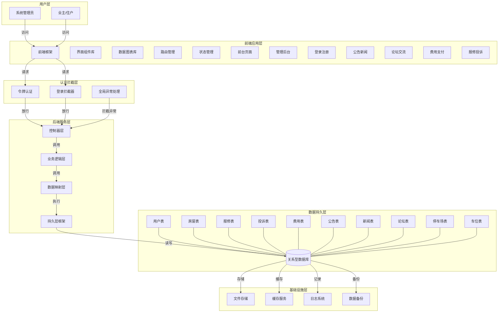
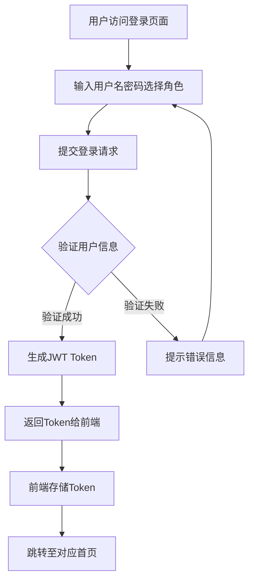
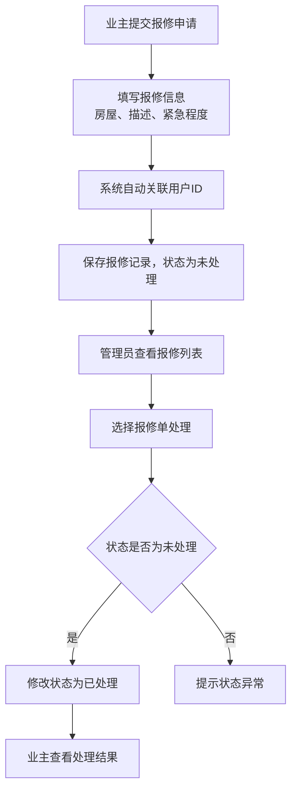
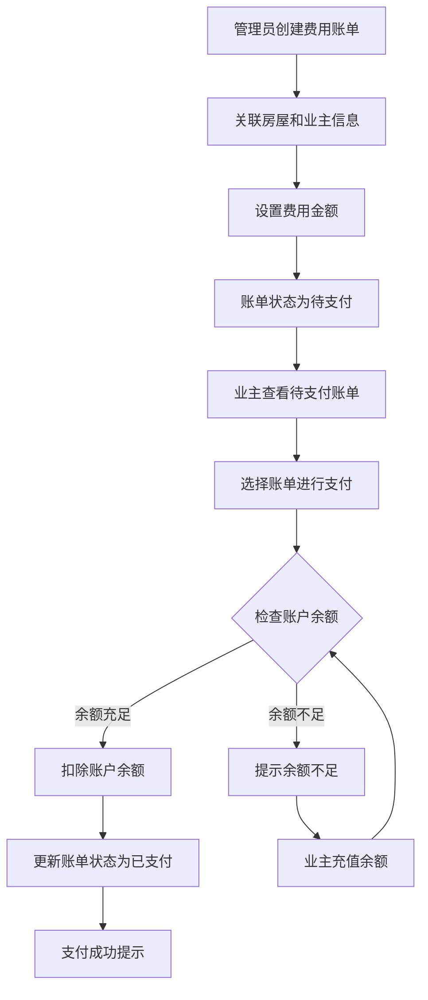
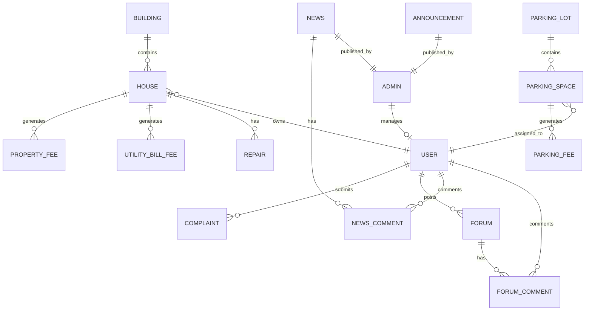

# 社区物业管理系统 - 需求分析文档

## 1. 项目概述

### 1.1 项目背景
社区物业管理系统是一个面向住宅小区的综合性管理平台，旨在提升物业管理效率和服务质量，为业主提供便捷的在线服务体验。系统通过数字化手段整合物业日常管理业务，实现信息公开、服务透明、缴费便捷的社区管理目标。

### 1.2 项目目标
- 实现物业日常管理的信息化、规范化
- 为业主提供便捷的在线服务入口
- 提升物业收费管理效率和透明度
- 建立业主与物业之间的有效沟通渠道
- 通过数据统计分析辅助管理决策

### 1.3 技术架构
| 层级 | 技术选型 | 说明 |
|------|---------|------|
| 前端框架 | Vue 3 + Vite | 现代化前端开发框架 |
| UI组件库 | Element Plus | 企业级UI组件库 |
| 图表库 | ECharts | 数据可视化图表 |
| 后端框架 | Spring Boot 3.2.10 | Java后端开发框架 |
| ORM框架 | MyBatis | 数据访问层框架 |
| 数据库 | MySQL 5.7+ | 关系型数据库 |
| 认证方式 | JWT Token | 无状态身份认证 |
| 文件上传 | 本地存储 | 最大100MB文件支持 |

### 1.4 系统架构图



---

## 2. 用户角色与场景

### 2.1 用户角色定义

| 角色 | 标识 | 权限范围 | 典型用户 |
|------|------|---------|---------|
| 系统管理员 | ADMIN | 系统所有功能权限 | 物业管理人员 |
| 业主/住户 | USER | 个人相关业务操作权限 | 小区业主 |

### 2.2 典型用户场景

#### 2.2.1 业主场景

| 场景编号 | 场景描述 | 涉及功能 |
|---------|---------|---------|
| USR-001 | 业主注册账号并完善个人信息 | 用户注册、个人信息管理 |
| USR-002 | 业主登录系统查看小区信息 | 用户登录、首页展示 |
| USR-003 | 业主浏览小区公告和新闻 | 公告查看、新闻浏览 |
| USR-004 | 业主在论坛发帖交流 | 论坛发帖、评论 |
| USR-005 | 业主提交房屋报修申请 | 报修申请、进度查询 |
| USR-006 | 业主提交投诉建议 | 投诉提交、状态查询 |
| USR-007 | 业主在线缴纳各项费用 | 物业费支付、水电费支付、停车费支付 |
| USR-008 | 业主查询个人费用账单 | 费用明细查询 |

#### 2.2.2 管理员场景

| 场景编号 | 场景描述 | 涉及功能 |
|---------|---------|---------|
| ADM-001 | 管理员登录系统管理后台 | 管理员登录、后台首页 |
| ADM-002 | 管理员管理业主信息 | 用户管理、信息审核 |
| ADM-003 | 管理员管理楼宇和房屋信息 | 楼宇管理、房屋管理 |
| ADM-004 | 管理员发布小区公告 | 公告发布、下架管理 |
| ADM-005 | 管理员发布小区新闻 | 新闻发布、评论管理 |
| ADM-006 | 管理员处理业主报修 | 报修审核、派单处理 |
| ADM-007 | 管理员处理业主投诉 | 投诉受理、反馈处理 |
| ADM-008 | 管理员管理收费项目 | 物业费管理、水电费管理、停车费管理 |
| ADM-009 | 管理员管理停车场和车位 | 停车场管理、车位分配 |
| ADM-010 | 管理员查看数据统计报表 | 数据可视化分析 |

---

## 3. 功能需求分析

### 3.1 用户认证与权限模块

| 需求编号 | 需求描述 | 优先级 | 验收标准 |
|---------|---------|--------|---------|
| AUTH-001 | 用户注册功能 | 高 | 用户可通过用户名、密码、昵称注册账号，新注册用户自动赠送100元余额 |
| AUTH-002 | 用户登录功能 | 高 | 支持管理员和业主两种角色登录，验证用户名密码后返回JWT Token，Token有效期30天 |
| AUTH-003 | 密码找回功能 | 中 | 用户可通过用户名找回密码，直接设置新密码（暂未实现验证码校验） |
| AUTH-004 | 密码修改功能 | 高 | 用户可修改当前登录密码，需验证旧密码正确性 |
| AUTH-005 | 个人信息修改 | 中 | 用户可修改昵称、头像、电话、邮箱 |
| AUTH-006 | 余额充值功能 | 中 | 业主可进行账户余额充值，充值金额直接累加到账户余额 |
| AUTH-007 | 登录拦截 | 高 | 未登录用户无法访问需要权限的页面，OPTIONS预检请求不做校验 |
| AUTH-008 | 用户状态校验 | 高 | 登录时校验用户状态，禁用状态用户无法登录 |

### 3.2 楼宇与房屋管理模块

| 需求编号 | 需求描述 | 优先级 | 验收标准 |
|---------|---------|--------|---------|
| BUILD-001 | 楼宇信息管理 | 高 | 支持楼宇的增删改查，包含编号、名称、地址、楼层数、单元数、户数等信息 |
| BUILD-002 | 房屋信息管理 | 高 | 支持房屋的增删改查，关联楼宇和业主，包含房屋编号、面积、户型等信息 |
| BUILD-003 | 房屋状态管理 | 高 | 房屋支持启用/停用状态管理 |
| BUILD-004 | 楼宇关联查询 | 中 | 可查看楼宇下的所有房屋信息 |

### 3.3 报修管理模块

| 需求编号 | 需求描述 | 优先级 | 验收标准 |
|---------|---------|--------|---------|
| REPAIR-001 | 报修申请提交 | 高 | 业主可选择房屋提交报修，填写描述和紧急程度，提交时自动关联当前用户ID，状态默认为"未处理" |
| REPAIR-002 | 报修处理功能 | 高 | 管理员可处理报修申请，仅当状态为"未处理"时可修改为"已处理" |
| REPAIR-003 | 报修状态追踪 | 高 | 业主可查看自己报修的处理进度，列表显示楼宇-房屋编号信息 |
| REPAIR-004 | 紧急程度分级 | 中 | 支持普通、紧急、特急等紧急程度设置 |
| REPAIR-005 | 预约时间设置 | 中 | 支持设置维修预约时间 |

### 3.4 投诉管理模块

| 需求编号 | 需求描述 | 优先级 | 验收标准 |
|---------|---------|--------|---------|
| COMPL-001 | 投诉提交 | 高 | 业主可提交投诉，选择类型并填写描述，提交时自动关联当前用户ID，状态默认为"未处理" |
| COMPL-002 | 投诉处理 | 高 | 管理员可处理投诉，仅当状态为"未处理"时可修改为"已处理" |
| COMPL-003 | 投诉状态追踪 | 高 | 业主可查看自己投诉的处理进度 |
| COMPL-004 | 投诉类型分类 | 中 | 支持多种投诉类型分类管理 |

### 3.5 公告管理模块

| 需求编号 | 需求描述 | 优先级 | 验收标准 |
|---------|---------|--------|---------|
| ANNOUNC-001 | 公告发布 | 高 | 管理员可发布公告，填写标题和内容 |
| ANNOUNC-002 | 公告下架 | 高 | 管理员可下架已发布的公告 |
| ANNOUNC-003 | 公告浏览 | 高 | 业主可浏览所有公告列表 |
| ANNOUNC-004 | 公告详情 | 高 | 业主可查看公告详细内容 |

### 3.6 新闻管理模块

| 需求编号 | 需求描述 | 优先级 | 验收标准 |
|---------|---------|--------|---------|
| NEWS-001 | 新闻发布 | 高 | 管理员可发布新闻，支持标题、内容、封面图 |
| NEWS-002 | 新闻列表 | 高 | 业主可浏览新闻列表 |
| NEWS-003 | 新闻详情 | 高 | 业主可查看新闻详细内容 |
| NEWS-004 | 新闻评论 | 中 | 业主可对新闻发表评论 |
| NEWS-005 | 评论管理 | 中 | 管理员可管理新闻评论 |

### 3.7 论坛管理模块

| 需求编号 | 需求描述 | 优先级 | 验收标准 |
|---------|---------|--------|---------|
| FORUM-001 | 帖子发布 | 高 | 业主可发布论坛帖子 |
| FORUM-002 | 帖子列表 | 高 | 业主可浏览论坛帖子列表 |
| FORUM-003 | 帖子详情 | 高 | 业主可查看帖子详细内容 |
| FORUM-004 | 帖子评论 | 高 | 业主可对帖子发表评论 |
| FORUM-005 | 评论管理 | 中 | 管理员可管理论坛评论 |
| FORUM-006 | 帖子审核 | 中 | 管理员可审核帖子状态 |

### 3.8 费用管理模块

| 需求编号 | 需求描述 | 优先级 | 验收标准 |
|---------|---------|--------|---------|
| FEE-001 | 物业费管理 | 高 | 管理员可创建物业费账单，创建时自动关联房屋所属业主 |
| FEE-002 | 物业费支付 | 高 | 业主可在线支付物业费，支付前校验状态为"未支付"，支付时扣除账户余额，余额不足时提示 |
| FEE-003 | 水电费管理 | 高 | 管理员可创建水电费账单，支持抄表读数、抄表日期、收费类型（水/电） |
| FEE-004 | 水电费支付 | 高 | 业主可在线支付水电费，支付逻辑同物业费 |
| FEE-005 | 停车费管理 | 高 | 管理员可创建停车费账单，关联车位和用户 |
| FEE-006 | 停车费支付 | 高 | 业主可在线支付停车费，支付逻辑同物业费 |
| FEE-007 | 费用查询 | 高 | 业主可查询个人费用账单列表，显示楼宇名称、房屋编号等关联信息 |
| FEE-008 | 余额扣款 | 高 | 支付时从用户余额中扣除相应费用，扣款后余额不能为负数 |

### 3.9 停车场管理模块

| 需求编号 | 需求描述 | 优先级 | 验收标准 |
|---------|---------|--------|---------|
| PARK-001 | 停车场管理 | 高 | 管理员可管理停车场信息，包含名称、地址、车位数量 |
| PARK-002 | 车位管理 | 高 | 管理员可管理车位信息，包含编号、类型、价格、位置 |
| PARK-003 | 车位分配 | 高 | 管理员可将车位分配给业主 |
| PARK-004 | 车位状态 | 中 | 车位支持空闲/已分配状态管理 |

### 3.10 数据统计模块

| 需求编号 | 需求描述 | 优先级 | 验收标准 |
|---------|---------|--------|---------|
| STAT-001 | 居民入住率统计 | 中 | 通过图表展示各楼宇入住率 |
| STAT-002 | 停车位使用情况 | 中 | 通过图表展示停车场车位使用情况 |
| STAT-003 | 物业费收缴统计 | 中 | 通过图表展示物业费收缴情况 |
| STAT-004 | 水费收缴统计 | 中 | 通过图表展示水费收缴情况 |
| STAT-005 | 电费收缴统计 | 中 | 通过图表展示电费收缴情况 |
| STAT-006 | 报修处理效率 | 中 | 通过图表展示报修处理效率 |

---

## 4. 非功能需求

### 4.1 性能需求

| 需求编号 | 需求描述 | 验收标准 |
|---------|---------|---------|
| PERF-001 | 页面响应时间 | 普通页面加载时间≤2秒，复杂列表页面≤3秒 |
| PERF-002 | 并发用户数 | 支持至少1000个并发用户同时在线 |
| PERF-003 | 数据库查询 | 单表查询响应时间≤0.5秒，关联查询≤1秒 |
| PERF-004 | 文件上传 | 支持最大100MB文件上传，上传速度稳定 |

### 4.2 安全性需求

| 需求编号 | 需求描述 | 验收标准 |
|---------|---------|---------|
| SEC-001 | 身份认证 | 使用JWT Token进行身份认证，Token有效期30天，使用HS256算法签名，密钥为固定字符串"1234567890" |
| SEC-002 | 密码存储 | 用户密码当前为明文存储（需后续优化为加密存储） |
| SEC-003 | 权限控制 | 不同角色访问不同功能模块，业主只能查看和操作个人相关数据，管理员拥有全部权限 |
| SEC-004 | 接口安全 | 通过LoginInterceptor拦截器对所有非OPTIONS请求进行Token校验，无效Token返回401状态码 |
| SEC-005 | 用户状态校验 | 登录时校验用户状态，禁用状态用户无法登录系统 |
| SEC-006 | Token存储 | Token存储在请求Header中，Key为"token"，后端通过ThreadLocal存储当前用户信息 |

### 4.3 可用性需求

| 需求编号 | 需求描述 | 验收标准 |
|---------|---------|---------|
| AVAIL-001 | 系统可用性 | 系统全年可用率≥99.5% |
| AVAIL-002 | 故障恢复 | 系统故障后恢复时间≤30分钟 |
| AVAIL-003 | 数据备份 | 数据库每日自动备份，备份数据可恢复 |

### 4.4 兼容性需求

| 需求编号 | 需求描述 | 验收标准 |
|---------|---------|---------|
| COMPAT-001 | 浏览器兼容 | 支持Chrome、Firefox、Edge主流浏览器最新版本 |
| COMPAT-002 | 分辨率适配 | 支持1280×720及以上分辨率显示正常 |
| COMPAT-003 | 操作系统 | 支持Windows、MacOS、Linux操作系统 |

---

## 5. 业务流程分析

### 5.1 用户登录流程



### 5.2 报修处理流程



### 5.3 费用支付流程



---

## 6. 数据需求分析

### 6.1 核心数据实体

| 实体名称 | 表名 | 核心字段 | 说明 |
|---------|------|---------|------|
| 管理员 | admin | id, username, password, nickname, tel, email, status | 系统管理员信息 |
| 用户 | user | id, username, nickname, password, avatarUrl, tel, email, balance, status | 业主用户信息 |
| 楼宇 | building | id, code, name, address, number, elementNumber, houseNumber, type, status | 小区楼宇信息 |
| 房屋 | house | id, buildingId, userId, houseNumber, area, houseType, status | 房屋信息 |
| 报修 | repair | id, houseId, userId, type, content, urgencyLevel, status, appointmentTime | 报修记录 |
| 投诉 | complaint | id, userId, type, content, status | 投诉记录 |
| 公告 | announcement | id, title, content, createTime | 小区公告 |
| 新闻 | news | id, title, content, image, createTime | 小区新闻 |
| 新闻评论 | news_comment | id, newsId, userId, content, parentId | 新闻评论 |
| 论坛 | forum | id, title, content, userId, status | 论坛帖子 |
| 论坛评论 | forum_comment | id, forumId, userId, content, parentId | 论坛评论 |
| 停车场 | parking_lot | id, name, address, parkingNum, status | 停车场信息 |
| 车位 | parking_space | id, parkingLotId, spaceNumber, type, userId, price, monthPrice, status | 车位信息 |
| 物业费 | property_fee | id, houseId, userId, fee, paymentStatus | 物业费账单 |
| 水电费 | utility_bill_fee | id, houseId, userId, type, reading, fee, paymentStatus, readingDate | 水电费用账单 |
| 停车费 | parking_fee | id, parkingSpaceId, userId, fee, paymentStatus | 停车费账单 |

### 6.2 数据关系



### 6.3 数据完整性约束

| 约束类型 | 约束描述 | 涉及实体 |
|---------|---------|---------|
| 主键约束 | 所有表的id字段为主键，自增 | 全部实体 |
| 外键约束 | 房屋关联楼宇和用户 | house.buildingId, house.userId |
| 外键约束 | 报修关联房屋和用户 | repair.houseId, repair.userId |
| 外键约束 | 投诉关联用户 | complaint.userId |
| 外键约束 | 评论关联新闻/论坛和用户 | news_comment, forum_comment |
| 外键约束 | 车位关联停车场和用户 | parking_space.parkingLotId, parking_space.userId |
| 外键约束 | 费用账单关联房屋/车位和用户 | property_fee, utility_bill_fee, parking_fee |
| 非空约束 | 核心业务字段非空 | 全部实体关键字段 |
| 唯一约束 | 用户名唯一 | user.username, admin.username |

---

## 7. 系统约束

### 7.1 技术约束

| 约束编号 | 约束描述 | 说明 |
|---------|---------|------|
| TECH-001 | Java版本 | 项目使用Java 17开发，部署环境需支持 |
| TECH-002 | MySQL版本 | 数据库使用MySQL 5.7+，需兼容UTF-8编码 |
| TECH-003 | 文件存储 | 文件上传存储于服务器本地，需保证存储空间充足 |
| TECH-004 | 端口配置 | 默认端口1000，需确保端口未被占用 |

### 7.2 业务约束

| 约束编号 | 约束描述 | 说明 |
|---------|---------|------|
| BUS-001 | 用户状态 | 用户状态分为启用/禁用，禁用用户无法登录 |
| BUS-002 | 房屋状态 | 房屋状态分为启用/停用，关联用户表示已入住 |
| BUS-003 | 支付状态 | 费用支付状态分为未支付/已支付，已支付账单不可重复支付 |
| BUS-004 | 报修状态 | 报修状态分为未处理/已处理，仅未处理状态可被处理 |
| BUS-005 | 投诉状态 | 投诉状态分为未处理/已处理，仅未处理状态可被处理 |
| BUS-006 | 余额规则 | 用户余额充值后累加，支付时扣除，余额不能为负数 |
| BUS-007 | 新用户赠金 | 新注册用户自动赠送100元初始余额 |

### 7.3 性能约束

| 约束编号 | 约束描述 | 说明 |
|---------|---------|------|
| PERF-001 | 数据量 | 单表数据量不超过10万条，超过需考虑分表 |
| PERF-002 | 查询响应 | 列表查询支持分页，默认每页10条 |
| PERF-003 | 文件大小 | 单个文件上传最大100MB，总请求最大1000MB |

---

## 8. 接口需求摘要

### 8.1 用户认证接口

| API路径 | HTTP方法 | 功能描述 | 权限 |
|---------|---------|---------|------|
| /common/login | POST | 用户登录，支持ADMIN/USER两种角色，返回JWT Token | 公开 |
| /common/register | PUT | 用户注册，新用户自动赠送100元余额 | 公开 |
| /common/currentUser | GET | 获取当前登录用户信息 | 已登录 |
| /common/updateCurrentUser | POST | 更新当前用户信息（昵称、头像、电话、邮箱） | 已登录 |
| /common/updatePassword | POST | 修改密码，需验证旧密码 | 已登录 |
| /common/retrievePassword | POST | 找回密码（暂未实现验证码校验） | 公开 |
| /common/resetPassword | POST | 管理员重置用户密码为默认密码 | ADMIN |

### 8.2 文件上传接口

| API路径 | HTTP方法 | 功能描述 | 权限 |
|---------|---------|---------|------|
| /file/upload | POST | 文件上传，返回文件访问路径 | 已登录 |
| /file/{fileName} | GET | 文件下载/访问 | 公开 |

### 8.3 核心业务接口

| API路径 | HTTP方法 | 功能描述 | 权限 |
|---------|---------|---------|------|
| /user/page | GET | 用户分页查询 | ADMIN |
| /user/topUp/{amount} | POST | 用户余额充值 | USER |
| /building/page | GET | 楼宇分页查询 | ADMIN |
| /building/add | POST | 新增楼宇 | ADMIN |
| /house/page | GET | 房屋分页查询 | ADMIN |
| /repair/page | GET | 报修分页查询 | 全部 |
| /repair/add | POST | 提交报修 | USER |
| /repair/handle/{id} | POST | 处理报修 | ADMIN |
| /complaint/page | GET | 投诉分页查询 | 全部 |
| /complaint/add | POST | 提交投诉 | USER |
| /complaint/handle/{id} | POST | 处理投诉 | ADMIN |
| /announcement/page | GET | 公告分页查询 | 全部 |
| /announcement/add | POST | 发布公告 | ADMIN |
| /news/page | GET | 新闻分页查询 | 全部 |
| /news/add | POST | 发布新闻 | ADMIN |
| /forum/page | GET | 论坛分页查询 | 全部 |
| /forum/add | POST | 发布帖子 | USER |
| /propertyFee/page | GET | 物业费分页查询 | 全部 |
| /propertyFee/pay/{id} | POST | 支付物业费 | USER |
| /utilityBillFee/page | GET | 水电费分页查询 | 全部 |
| /utilityBillFee/pay/{id} | POST | 支付水电费 | USER |
| /parkingLot/page | GET | 停车场分页查询 | ADMIN |
| /parkingSpace/page | GET | 车位分页查询 | ADMIN |
| /parkingFee/page | GET | 停车费分页查询 | 全部 |
| /parkingFee/pay/{id} | POST | 支付停车费 | USER |
| /echarts/* | GET | 数据统计接口 | ADMIN |

---

## 9. 验收标准汇总

### 9.1 功能验收

所有功能需求编号对应的功能需满足：
1. 功能实现完整，无遗漏
2. 操作流程顺畅，无卡顿
3. 数据存储正确，无数据丢失
4. 权限控制有效，越权访问被拦截

### 9.2 非功能验收

| 类别 | 验收标准 |
|------|---------|
| 性能 | 页面响应≤2秒，数据库查询≤1秒 |
| 安全 | 密码加密存储，JWT认证有效，权限校验完整 |
| 可用 | 系统可用率≥99.5%，故障恢复≤30分钟 |
| 兼容 | 主流浏览器正常显示，不同分辨率适配良好 |

### 9.3 数据验收

| 类别 | 验收标准 |
|------|---------|
| 完整性 | 所有约束条件生效，数据关联正确 |
| 一致性 | 操作后数据状态同步更新 |
| 准确性 | 计算结果正确，统计数据准确 |

---

## 10. 需求优先级说明

| 优先级 | 定义 | 说明 |
|--------|------|------|
| 高 | P0 | 核心功能，必须实现，影响系统基本运行 |
| 中 | P1 | 重要功能，建议实现，提升用户体验 |
| 低 | P2 | 辅助功能，可后续迭代，增强系统能力 |

**优先级分布统计**：
- 高优先级需求：约65%
- 中优先级需求：约25%
- 低优先级需求：约10%

---

## 附录：代码结构参考

### 后端代码结构

```
src/main/java/com/project/platform/
├── config/          # 配置类
│   ├── CorsConfig.java
│   ├── LocalDateTimeConfig.java
│   └── SpringMvcConfig.java
├── controller/      # 控制器层（16个控制器）
├── dto/             # 数据传输对象
├── entity/          # 实体类（16个实体）
├── exception/       # 异常处理
├── interceptor/     # 拦截器（登录拦截）
├── mapper/          # 数据访问层（XML映射）
├── service/         # 业务逻辑层
│   └── impl/        # 服务实现
├── utils/           # 工具类（JWT、ThreadLocal）
└── vo/              # 视图对象（响应、分页、图表）
```

### 前端代码结构

```
web/src/
├── assets/          # 静态资源
├── components/      # 公共组件（编辑器、上传）
├── router/          # 路由配置
├── styles/          # 样式文件
├── utils/           # 工具函数（HTTP、工具）
└── views/           # 页面视图
    ├── admin/       # 管理后台（18个页面）
    ├── front/       # 前台页面（7个页面）
    └── layout/      # 布局组件
```
