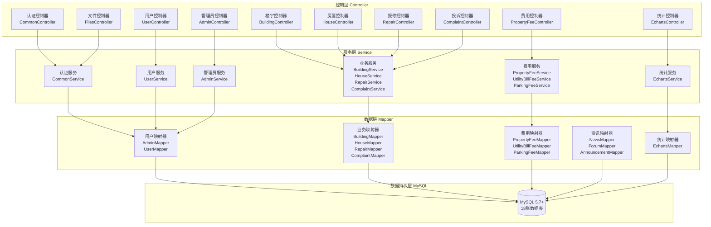
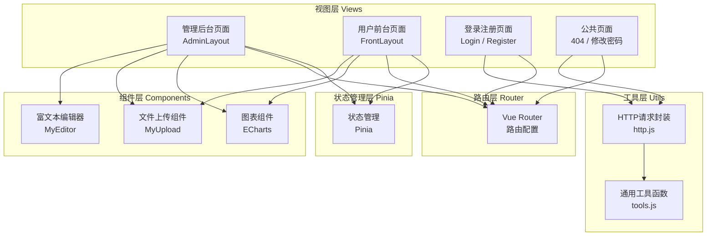
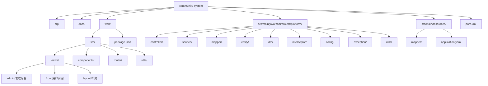

# 社区物业管理系统 - 项目介绍文档

## 一、项目基本信息

### 项目名称
**社区物业管理系统**（community-system）

### 项目版本
**1.0.0-SNAPSHOT**

### 开发背景
随着社区规模的不断扩大，传统的物业管理模式（人工登记、纸质记录）已无法满足现代社区管理的需求。该系统旨在通过信息化手段，实现物业管理的数字化、智能化，提升管理效率和服务质量，为业主和物业管理者提供便捷的互动平台。

### 核心目标
1. **提高管理效率**：自动化处理物业收费、报修投诉、停车管理等业务流程
2. **提升服务质量**：为业主提供便捷的在线服务通道
3. **数据可视化**：通过统计图表直观展示小区运营数据
4. **信息公开透明**：公告、新闻等信息及时发布，增强业主与物业的沟通

---

## 二、技术栈选型

### 后端技术栈

| 技术 | 版本 | 用途 |
|------|------|------|
| **Java** | 17 | 编程语言，LTS 版本 |
| **Spring Boot** | 3.2.10 | 后端框架，简化开发配置 |
| **MyBatis** | 3.0.4 | ORM 框架，数据库操作 |
| **MySQL** | 5.7+ / 8.0.31 | 关系型数据库 |
| **JWT (jjwt)** | 0.9.1 | 身份认证令牌 |
| **Hutool** | 5.7.20 | 工具类库 |
| **FastJSON** | 2.0.53 | JSON 序列化 |
| **Lombok** | - | 简化 Java 代码 |

### 前端技术栈

| 技术 | 版本 | 用途 |
|------|------|------|
| **Vue** | 3.4.29 | 前端框架 |
| **Vite** | 5.3.1 | 构建工具 |
| **Element Plus** | 2.8.4 | UI 组件库 |
| **Pinia** | 2.2.2 | 状态管理 |
| **Vue Router** | 4.4.3 | 路由管理 |
| **ECharts** | 5.5.1 | 数据可视化图表 |
| **Axios** | 1.7.5 | HTTP 请求 |
| **WangEditor** | 5.1.14 | 富文本编辑器 |
| **v-md-editor** | 2.3.18 | Markdown 编辑器 |

### 基础设施
- **文件存储**：本地 uploads 目录，最大文件限制 100MB
- **服务端口**：后端 1000，前端 5173
- **CORS 配置**：允许跨域请求

---

## 三、目标用户群体

### 系统管理员
- **职责**：系统的最高权限用户，负责整体系统管理
- **主要功能**：用户管理、楼宇管理、费用管理、数据统计等

### 业主/住户
- **职责**：社区居民
- **主要功能**：浏览公告新闻、提交报修投诉、在线缴费、论坛交流等

---

## 四、主要功能模块

### 1. 用户认证模块
- 登录（管理员/业主区分）
- 注册（新用户赠送 100 元余额）
- 修改密码
- 找回密码
- 重置密码（管理员操作）

### 2. 用户管理模块
- 用户列表分页查询
- 用户信息新增/编辑/删除
- 用户状态管理（启用/禁用）
- 余额充值

### 3. 楼宇管理模块
- 楼宇信息管理（编号、名称、地址、楼层数、单元数、户数）
- 楼宇状态管理

### 4. 房屋管理模块
- 房屋信息管理（关联楼宇和业主）
- 房屋面积、类型管理

### 5. 报修管理模块
- 业主提交报修申请
- 管理员处理报修（状态从"未处理"→"已处理"）
- 报修记录查询（业主只能看自己的）

### 6. 投诉管理模块
- 业主提交投诉
- 管理员处理投诉
- 投诉记录查询

### 7. 公告管理模块
- 管理员发布公告
- 业主浏览公告列表

### 8. 新闻管理模块
- 管理员发布新闻（含封面图）
- 业主浏览新闻列表
- 新闻评论功能（支持回复）

### 9. 论坛管理模块
- 业主发布帖子
- 帖子评论功能（支持回复）
- 管理员管理论坛内容

### 10. 费用管理模块
- **物业费管理**：创建账单、在线支付、缴费记录查询
- **水电费管理**：水费/电费抄表、账单生成、在线支付
- **停车费管理**：车位费用管理、在线支付

### 11. 停车场管理模块
- 停车场信息管理
- 车位信息管理（关联业主）

### 12. 文件上传模块
- 图片/文件上传
- 文件访问服务

### 13. 数据统计模块
- 居民入住率统计
- 物业费收缴情况统计
- 停车位使用情况统计
- 报修处理效率统计

---

## 五、项目架构设计

### 架构模式
**前后端分离 + 分层架构**

### 后端架构层次



### 前端架构层次



### 认证机制
- **JWT Token**：登录成功后返回 Token，有效期 30 天
- **拦截器**：`LoginInterceptor` 拦截所有请求，校验 Token
- **ThreadLocal**：`CurrentUserThreadLocal` 存储当前登录用户信息
- **全局异常处理**：`GlobalExceptionHandler` 统一处理异常

### 数据库设计
**18 张数据表**：
- 用户类：`admin`, `user`
- 房产类：`building`, `house`
- 服务类：`repair`, `complaint`
- 资讯类：`announcement`, `news`, `news_comment`, `forum`, `forum_comment`, `comments`
- 费用类：`property_fee`, `utility_bill_fee`, `parking_fee`
- 停车类：`parking_lot`, `parking_space`
- 统计类：`echarts`（通过 Mapper 查询）

---

## 六、项目开发进度

### 当前状态：**开发完成，可运行**

### 已完成功能
| 模块 | 状态 | 说明 |
|------|------|------|
| 用户认证 | ✅ | 登录、注册、密码管理完整实现 |
| 用户管理 | ✅ | CRUD + 状态管理 + 余额充值 |
| 楼宇管理 | ✅ | CRUD 完整实现 |
| 房屋管理 | ✅ | CRUD + 关联楼宇和业主 |
| 报修管理 | ✅ | 提交 + 处理 + 状态流转 |
| 投诉管理 | ✅ | 提交 + 处理 + 状态流转 |
| 公告管理 | ✅ | 发布 + 浏览 |
| 新闻管理 | ✅ | 发布 + 浏览 + 评论 |
| 论坛管理 | ✅ | 发帖 + 评论 |
| 费用管理 | ✅ | 物业费/水电费/停车费完整支付流程 |
| 停车场管理 | ✅ | 停车场 + 车位管理 |
| 文件上传 | ✅ | 上传 + 访问服务 |
| 数据统计 | ✅ | ECharts 图表数据接口 |

### 待优化项（根据代码分析）
1. **密码安全**：当前密码明文存储，需加密
2. **找回密码**：缺少验证码校验（代码中标记 TODO）
3. **并发安全**：支付操作无锁机制，存在并发问题
4. **权限细化**：部分接口缺少角色权限校验
5. **输入校验**：部分字段缺少前端/后端校验（如金额负数）

### 项目构建状态
- ✅ Maven 构建成功（已生成 target 目录）
- ✅ 前端依赖已安装（package.json 完整）
- ✅ 数据库脚本已准备（sql/sql.sql）

---

## 七、项目目录结构



---

## 八、运行方式

### 后端启动
```bash
cd community-system
mvn spring-boot:run
# 服务访问地址：http://localhost:1000
```

### 前端启动
```bash
cd community-system/web
npm install
npm run dev
# 服务访问地址：http://localhost:5173
```

### 数据库初始化
```sql
-- 创建数据库
CREATE DATABASE community_system CHARACTER SET utf8mb4;
-- 导入脚本
source sql/sql.sql;
```

---
